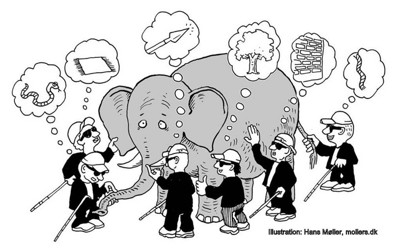

# _L'intelligence collective sauvera-t-elle l'humanité ou est-ce une mode de plus ?_
la conférence dont vous êtes le héros !

---

# Votre mission si vous l'acceptez:
- co-construire une conférence sans conférencier
- expérimenter (on prendra peut être une gamelle, mais c'est pas grave)
- passer un bon moment

**pour réussir à plus de 100 et en une heure: le temps sera limité, _allez à l'essentiel !!!_** 

---

# Règles du jeu

- soyez bienveillants
- tous les points de vues sont légitimes, il n'y a pas une vérité absolue
- évitez les monologues ou les ping pong à 2: une astuce, remettre la parole au centre après avoir parlé
- Soyez à l'écoute du centre

---

# Déroulé

<!---dessin mélanie 

1er partie: définition collective de l'intelligence collective: construire du sens et une définition commune de l'ic

sous-groupes 3 -> 6 -> 12

2eme partie: travail sur les thèmes/hypothèses: co-construire un savoir commun sur les hypothèses

10 sous groupes de 12, 2 sous-groupes par thèmes.

5 thèmes: definition IC + 4 hypothèses de travail

Choix de 2 rapporteurs / personnes éloquentes par groupe

3ème partie: mode conférence 

--->

---

# 1er partie: définition collective de l'intelligence collective

---
# 1ère itération: Tour de chauffe

- se placer par 3 avec une mindmap papier
- se présenter les uns aux autres (nom-prénom, rien de plus pour l’instant !)
- discutez pour identifier 3 notions, concepts, idées qui vous viennent à l’esprit quand vous pensez à l’intelligence collective.
- Vous avez 3 min !

---
# 2ème itération : Tour d’échange

- chaque trinome s'associe à un autre trinome
- se présenter les uns aux autres  (nom-prénom)
- par 6, discutez les notions déja identifiées
- **complétez** UNE des 2 feuilles (l’autre est abandonnée) avec 3 notions supplémentaires
- Vous avez 3 min !

---

# 3ème itération : Tour d’affinage

- chaque groupe de 6 s'associe à un autre groupe de 6
- se présenter les uns aux autres (nom-prénom)
- par 12, discutez les notions déja identifiées
- complétez UNE des 2 feuilles (l’autre est abandonnée) avec 6 notions, concepts,idées supplémentaires qui vous viennent à l’esprit quand vous pensez à l’intelligence collective et au mots déjà présents sur la feuille.
- Vous avez 7 min !
- La feuille complétée est collée sur le mur prévu.

---

# 2eme partie: travail sur les thèmes/hypothèses

---

# Capitalisation définition de l'IC

- 2 sous-groupes de 12 volontaires
- rédiger une synthèse

---

# Travail sur les hypothèses

il y aura 8 sous-groupes, travaillant sur 4 hypothèses, soit 2 groupes par hypothèses.

---

# Les hypothèses
- L'intelligence collective peut-elle se passer du numérique et/ou des licences libres ?
- L'intelligence collective existe-t-elle vraiment dans l'enseignement ?
- L'intelligence collective peut-elle vraiment se pratiquer dans le privé ?
- L'intelligence collective peut-elle vraiment être menée à l'échelle d'un large territoire ?

---

# Travail par groupe de 12

- utilisez la matrice comme outil d'aide à la reflexion
- Comment reformuleriez-vous cette hypothèse ?
- Comment la préciseriez-vous ?
- Donner 2 exemples (+ ou -) illustrant cette hypothèse
- Un regard bienveillant
- Un regard critique
- Positionnement du groupe (pour, contre, indécis...)
- **allez à l'essentiel, vous avez 10 min**

---

# Recroisement des hypothèses entre les deux sous-groupes
- les 2 sous-groupes ayant travaillé sur la même question se rapprochent
- Compilation des travaux
- Positionnement
- Choix des rapporteurs (si possible homme/femme)
- Soyez brefs dans vos échanges afin de vous partager la parole (vous avez 10 min)

---

# 3eme partie: mode conférence
- prépa de la salle
- les rapporteurs ont 5 min pour affiner leur discours.

---

# Conférence
- définition de l'intelligence collective (3-5 min)
- L'intelligence collective peut-elle se passer du numérique et/ou des licences libres ? (3-5 min)
- L'intelligence collective existe-t-elle vraiment dans l'enseignement ? (3-5 min)
- L'intelligence collective peut-elle vraiment se pratiquer dans le privé ? (3-5 min)
- L'intelligence collective peut-elle vraiment être menée à l'échelle d'un large territoire ? (3-5 min)
- conclusion (2 min)

---

<!---

Pour comprendre la complexité, avoir un seul point de vue ne suffit pas.

L'intelligence collective se nourrit de la diversité des points de vue. 

Comment créer des cadres qui favorisent l'intelligence collective, c'est ce que nous étudierons ensemble durant ces 3 jours.

--->

---

# Glossaire de la coopération
- huit.re/glossaire-coop
