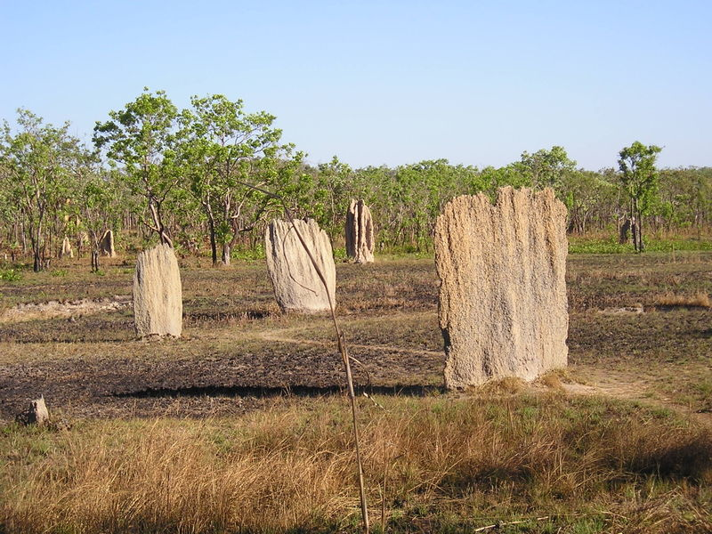

<!-- $theme: gaia -->

# La stigmergie

## un nouveau modèle de coopération

### Licences et auteurs: 
CC-BY-SA Lilian RICAUD

----

# Coopération vs Collaboration

votre définition ?
avantage ? inconvénients ?

----

---

# Un chef des termites ?

---

# Un conseil des termites ?

---

# Hierarchie pyramidale

----

---

# Hierarchie de consensus

----

