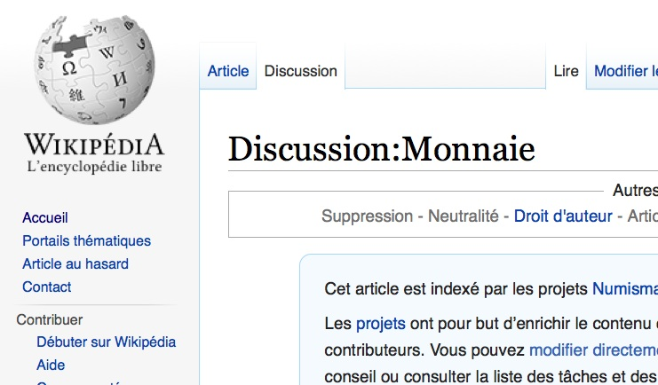

# Trame prez stigmergie V2

## les formes de collaborations

### Collaboration

### Coopération

### Intelligence collective originelle

### Intelligence collective pyramidale

### Intelligence collective essaim

### intelligence collective holomidale

### Inconvénients

## Stigmergie

### 

# La stigmergie pour les organisations humaines

---

---

## Pause discussion public

_connaissez vous des exemples ?_

# Wikipédia comme système stigmergique

---

# Objectif prépondérant

> « Imaginez un monde dans lequel chaque être humain peut librement obtenir et partager des connaissances. Ceci est notre engagement. » – Vision de la Wikimedia foundation

<!--- La vision de la Wikimédia foundation est un bel exemple d’objectif prépondérant --->

---

# Règles simples

Principes fondateurs de Wikipedia

    Pertinence encyclopédique
    Neutralité de point de vue,
    Contenu libre
    Savoir-vivre
    Souplesse des règles

<!--- Wikipédia possède quelques règles simples, mais essentielles qui régissent le projet et sa gouvernance --->

---

# Laisser des traces/modifier l’environnement pour rendre visible l’action en cours

---

<!--- 

une ébauche d’article sur wikipédia. 

La taille d’un article est un premier signal pour encourager d’autres participants à compléter l’article. 

Le bandeau signalant la qualité d’ébauche et encourageant la participation renforce ce signal.

--->

---

<!---

un lien en rouge signale que la page lié n’existe pas encore. Le fait que le lien ait été placé indique un appel à créer cette nouvelle page et facilite la création de cette nouvelle page

--->

---

# Autorisation a priori / Ouverture a priori / Transparence:

---

---

---

---

# Utilisation d'une licence libre

---

---

---

# Auto allocation des tâches

<!---
Sur Wikipédia,chacun est libre de se positionner sur à peu près n’importe quelle tache.

Que ce soit éditer les très nombreuses pages, ajouter des photos, améliorer le logiciel, faire un don, accueillir les nouveaux ou aider à résoudre les conflits en interne, il existe de nombreuses façon de contribuer spontanément.

--->

---
# Grand nombre et grande diversité d’agents

<!--- 

Notez que s’il y a une certaine diversité globale (nombreuses langues et cultures), Wikipédia souffre encore d’une disproportion en faveur d’une population de jeunes adultes masculins occidentaux, ce qui explique que les pages sur les jeux vidéos soient très complètes alors que d’autres sujets plus encyclopédiques restent mal traités.

Ceci peut aussi poser parfois problème au niveau de l’intégration des nouveaux ou d’autres groupes culturels qui peuvent se sentir exclus. Accroitre la diversité des contributeurs reste un enjeu pour Wikipédia.

---> 

---

# Fonctionner par étapes / itérations / cycles successifs

---

---

# Contrôle a posteriori

---

<!---

Le système d’historique qui enregistre et permet de comparer les différentes versions des pages facilite ce contrôle par la communauté page par page ou sur l'ensemble de l'encyclopedie.

--->

---

# Gestion des taches critiques / essentielles

---

<!---
Si certaines taches ne sont pas critiques pour l’encyclopédie (si un article est incomplet, cela ne nuit pas à l’avenir du projet), d’autres en revanche sont essentielles. Si les serveurs qui hébergent le projet tombent en panne ou que le nom de domaine n’est pas renouvelé, cela aura un grave impact sur le projet.

Pour assurer la gestion des taches critiques (collecte des fonds qui servent à payer l’hébergement et d’autres travaux servant au développement de l’encyclopédie) a été mis en place la Wikimedia Foundation, un organisme à but non lucratif.

L’objectif de la Wikimedia Foundation est de « promouvoir la croissance et le développement de projets de diffusion du savoir libre fondés sur le principe du wiki, et d’en distribuer le contenu publiquement et gratuitement ».

Elle ne possède aucun droit éditorial sur les contenus proposés sur le site de Wikipédia mais organise les campagnes de financement et redistribue les dons des utilisateurs pour faire tourner les taches critiques des projets (hébergement des différents projets Wikimedia multilingues, développements informatiques, actions de communication…).

--->

---

# Accepter les branches parallèles

<!---

Par rapport à ma grille de principes, celui ci ne semble pas être respecté, puisque que chaque article a une version unique et qu’il n’est pas possible de créer une version parallèle d’un article.

Cela tient au fait que Wikipédia ayant pour mission de fournir une encyclopédie objective/neutre et universelle, une seule version de chaque sujet existe. Ceci peut parfois être un problème ou un sujet complexe ne fait pas consensus et la page doit pourtant offrir une version unique et objective.

Pourtant, on pourrait imaginer une architecture où chaque sujet pourrait avoir différentes pages subjectives qui permettrait au lecteur d’avoir non pas une version unique et « objective » de la vérité, mais plusieurs versions ouvertement subjectives, qui pourraient peindre un tableau plus réaliste de la vérité.

Notez cependant qu’il est courant qu’un même article rédigé dans différentes langues montre des différences et des spécificités liées à la culture, au niveau de connaissance… On peut donc aussi voir les différentes Wikipédias multilingues comme des branches parallèles qui peuvent se nourrir mutuellement. C’est une richesse sous exploité à l’heure actuelle. On pourrait imaginer la mise en place de mécanismes pour tirer parti de cette diversité.

--->

--- 
