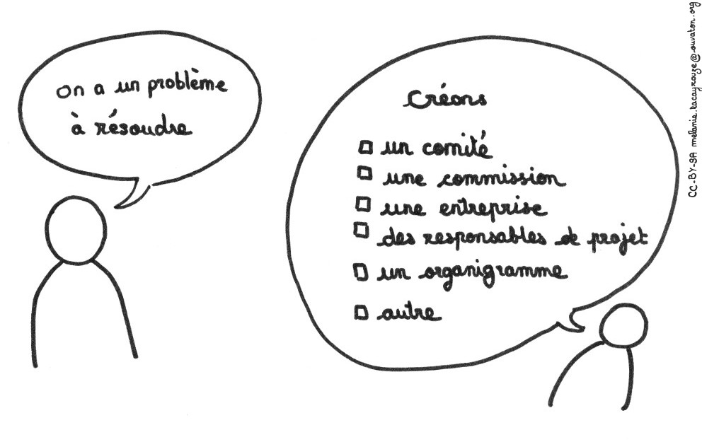
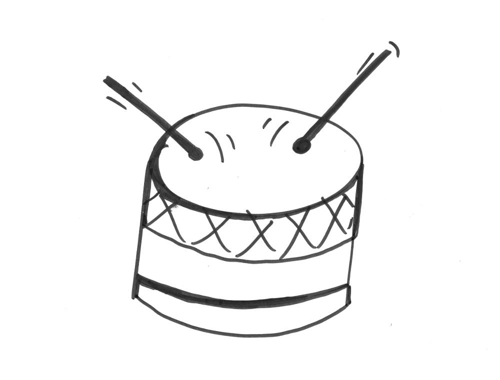
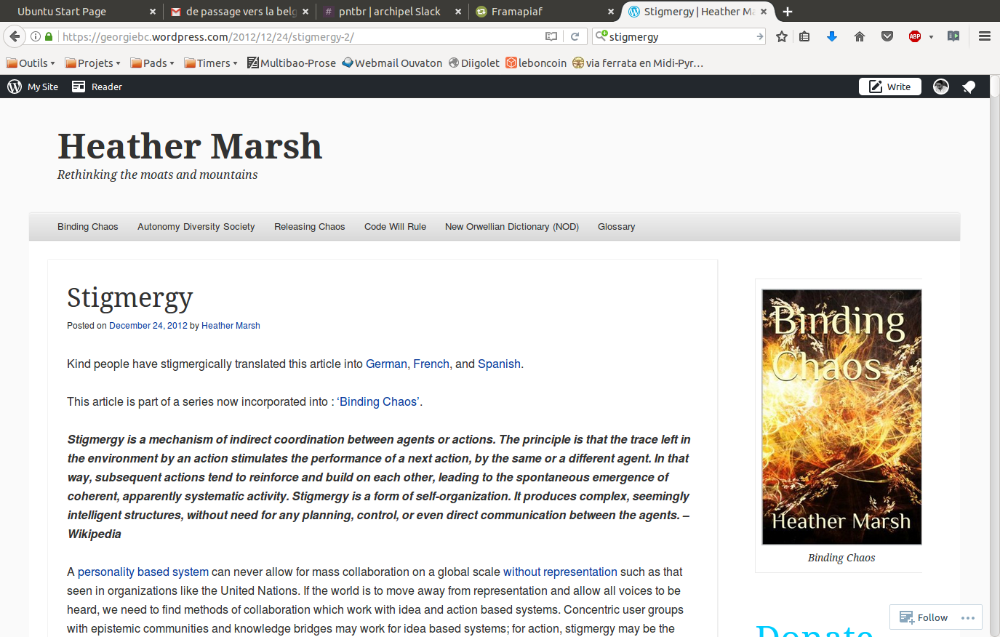
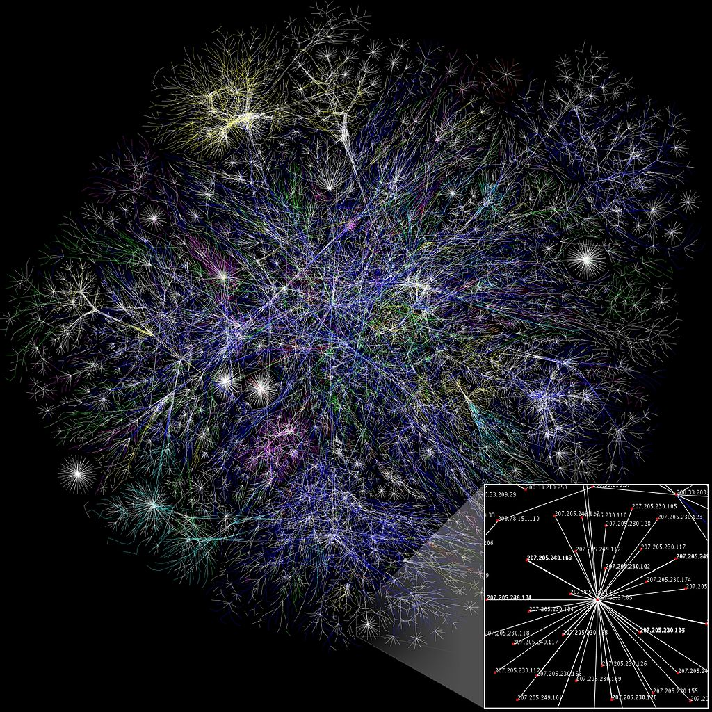

# Stigmergie, auto-organisation et collaboration à grande échelle

## Agile Tour Bordeaux 2017

---

# Stigmergie, auto-organisation et collaboration à grande échelle

CC-BY-SA Lilian RICAUD

<!-- footer:stigmergie - CC-BY-SA Lilian RICAUD 

Note: cette présentation a été rédigée en markdown en utilisant le  logiciel libre Marp et exportée en PDF dans le même dépot.

Ceci permet de partager la présentation ainsi que le fichier source dans un format facile à cloner, partager et modifier.

Le contenu lui même peut être lu en ligne via github et le fichier peut être exporté, lu et modifié en utilisant Marp.

Ceci me permet de partager mes contenus sans travail supplémentaire pour moi.

-->

---

# Comment travaillons nous ensemble ?

---

<!--- 

## orchestre: les taches sont réparties préalablement, chacun joue sa partition sous la conduite d'un chef d'orchestre

source de l'image: https://upload.wikimedia.org/wikipedia/commons/e/e6/Concert_orchestre_symphonique_Arsenal_Metz.jpg

Marche bien, mais devient difficile au fur et à mesure que la taille du groupe augmente avec une taille optimale au dessous de 25 personnes. Nécessite un chef, un guide au dela de ce point.

on "joue" ensemble mais comme on jouerai dans le cadre d'un jeu (avec des règles du jeu communes à toustes).

--->

---

<!--- 
improvisation d'un jazz band: les musiciens ne jouent pas une partition prédéfinie, mais sont en écoute les un des autres pour collaborer.

intense et faisable seulement pour de tout petits groupes (2-7)

on "joue" ensemble (sans règles du jeu)

--->

---

<!---
# Command and control

Pour de très larges groupes, avoir un leader et une chaine de commandement devient essentiel.

Cela marche bien pour de très larges groupes, mais cela uniformise les individus. 

cela n'est plus vraiment un jeu et les individus ont tendance à être traités comme des machines.

--->

---

# Inconvénients des modes de travail actuels

<!---

levez la main si ça vous rappelle quelque chose/si vous avez vécu une telle situation

--->

---

---

---

---

---

---

---

---

---

---

---

---

---

# Hiérarchie pyramidale et modèles compétitifs

----

<!---

moi l'individu, je ne suis pas libre de mes choix et je me sens un peu écrasé par cette hiérachie

--->

---

# Hiérarchie de consensus et modèles coopératifs

----

<!---

même si c'est "coopératif", moi l'individu, je ne suis pas libre de mes choix et je me sens un peu écrasé par cette hiérachie

--->

---

# Hiérarchies pyramidales et de consensus sont des modèles de contrôle *a priori* 

---

# une autre option ?

---

<!--- 

Voyons ce qui se passe chez les termites ? Comment s'organisent elles pour fonctionner ensemble ?

Source image: Photo prise par Bmdavll et mise à disposition sous License GFDL

--->

---

<!---

# Un chef des termites ?

--->

---

<!---
# Un conseil des termites ?

When termites construct their nests, they use predominantly indirect communication. No single termite would be in charge of any particular construction project. Individual termites react rather than think, but at a group level, they exhibit a sort of collective cognition. Specific structures or other objects such as pellets of soil or pillars cause termites to start building. The termite adds these objects onto existing structures, and such behaviour encourages building behaviour in other workers. The result is a self-organised process whereby the information that directs termite activity results from changes in the environment rather than from direct contact among individuals. Source:
https://en.wikipedia.org/wiki/Termite#Communication

--->

---

# Stigmergie

> grecs στιγμα (stigma) « marque, signe » et εργον (ergon) « travail, action »

---

# stigmergie

> La stigmergie est une méthode de communication indirecte dans un environnement émergent auto-organisé, où les individus communiquent entre eux en modifiant leur environnement.

Wikipedia

---

# stigmergie

> La stigmergie est une méthode de **communication indirecte** dans un environnement **émergent auto-organisé**, où les individus communiquent entre eux **en modifiant leur environnement**.

Wikipedia

---

# La stigmergie chez les fourmis

<!---Image:
Par Mehmet Karatay — Travail personnel, CC BY-SA 3.0, https://commons.wikimedia.org/w/index.php?curid=2179109
--->

---

<!---

Notes : 1) la première fourmi trouve la source de nourriture (F), via un chemin quelconque (a), puis revient au nid (N) en laissant derrière elle une piste de phéromone (b). 2) les fourmis empruntent indifféremment les 4 chemins possibles, mais le renforcement de la piste rend plus attractif le chemin le plus court. 3) les fourmis empruntent le chemin le plus court, les portions longues des autres chemins voient la piste de phéromones s'évaporer.

Source: https://commons.wikimedia.org/wiki/File:Aco_branches.svg?uselang=fr

Plus d'informations:

Les fourmis utilisent l’environnement comme support de communication : elles échangent indirectement de l’information en déposant des phéromones, le tout décrivant l’état de leur « travail ». L’information échangée a une portée locale, seule une fourmi située à l’endroit où les phéromones ont été déposées y a accès.

https://fr.wikipedia.org/wiki/Algorithme_de_colonies_de_fourmis

--->

---

<!---
La stigmergie produit des structures complexes

La vidéo ci-dessous montre une fourmilière déterrée par des chercheurs après avoir été remplie de béton pour figer sa structure. Le résultat est à couper le souffle.

https://www.youtube.com/watch?v=lFg21x2sj-M

--->
---

<!---
La stigmergie produit des structures complexes

La structure couvre 50 mètres carrés, descend à 8 mètres de profondeur et lors de sa conception a nécessité le déplacement de 40 tonnes de terre.

Les tunnels sont conçus de façon optimales pour assurer une bonne ventilation mais aussi la route la plus courte,  la structure comportant de véritables  « autoroutes » souterraines et des routes plus petites, connectant des chambres principales, des fosses à ordures, et des « jardins à champignons » où la température et l’humidité sont contrôlées et où les fourmis nourrissent de feuilles broyées un  mycélium qu’elles récoltent ensuite.

On dirait que la structure a été conçue par un architecte génial, mais tout a été fait par l’intelligence collective de la colonie qui se comporte comme un super-organisme.

Pourtant toutes les fourmis ne sont pas actives, une récente étude américaine a révélé qu'au sein d'une colonie de fourmis, près de la moitié est en général inactive.
Read more at http://www.atlantico.fr/decryptage/verite-fourmis-60-entre-elles-sont-grosses-paresseuses-qui-ne-font-rien-et-est-pas-tout-jean-luc-mercier-2228365.html#ziOO23gfqhYZG6pp.99: http://www.atlantico.fr/decryptage/verite-fourmis-60-entre-elles-sont-grosses-paresseuses-qui-ne-font-rien-et-est-pas-tout-jean-luc-mercier-2228365.html

--->

---

# la stigmergie c'est ...

 
--- 
##  un mécanisme de coordination indirecte

--- 
## un système auto-organisé

---

## une boucle: action -> trace -> action ...

--- 

## orienté sur l'action et le choix individuel 

---

## un mécanisme qui produit des structures complexes 

sans avoir besoin de plan, de contrôle ou même de communication directe entre les agents.

---

# La stigmergie existe aussi chez les humains

---

---

## Pause discussion 

_connaissez vous d'autres exemples ?_

<!--- discussion dans la salle --->

---

# La stigmergie pour les organisations humaines

---

<!--- une très grande partie de ce travail a été inspiré par l'article "Stigmergy" écrit par Heather Marsh. Je n'insisterai jamais assez sur l'importance de lire cet article brillant.

https://georgiebc.wordpress.com/2012/12/24/stigmergy-2/

traduction française: http://www.lilianricaud.com/travail-en-reseau/la-stigmergie-un-nouvelle-modele-de-gouvernance-collaborative/

--->

---

<!---

# Processus

une idée initiale est donnée librement, et le projet est conduit par l’idée, pas par une personnalité ou un groupe de personnalités. Aucun individu n’a besoin de permission (modèle compétitif) ou de consensus (modèle coopératif) pour proposer une idée ou initier un projet. Il n’y a pas besoin de discuter ou de voter une idée, si une idée est intéressante ou nécessaire, elle va susciter de l’intérêt. L’intérêt viendra de personnes activement impliquées dans le système et qui auront la volonté de fournir les efforts pour porter le projet plus loin. Cela ne viendra pas de votes vides de personnes qui n’ont qu’un tout petit peu d’intérêt ou d’implication dans le projet . Tant que le projet est soutenu ou rejeté sur la base d’efforts contributifs et non pas sur des votes vides, la contribution de personnes engagées dans l’idée aura plus de poids. La stigmergie met aussi les individus en situation de contrôler leur propre travail, ils n’ont pas besoin de la permission du groupe pour leur dire avec quelle méthode travailler ou à quelle partie contribuer.

--->

---

---

<!---

# Modèle stigmergique
## Ouverture / autorisation *a priori*

--- 

## liberté de créer sans prendre en compte acceptation ou rejet 

--- 

## liberté d'accepter ou de rejeter un travail, une tache

--- 

## liberté de créer une alternative

--->

---

<!---
Internet
--->

---

# Traduction stigmergique

<!---
L'article sur la stigmergie de heather Marsh a lui même été traduit de manière stigmergique, sans concertation particulière entre les participants et principalement via les traces laissées sur le pad:
http://pad.imaginationforpeople.org/p/stigmergy

--->

---

# Les communautés du libre

<!---

Les communautés du libre

Linux, Wikipédia, WordPress, Firefox … longtemps marginaux, les projets rassemblant des volontaires qui travaillent en collaboration à distance sont de plus en plus courants et concurrencent grandes entreprises et institutions pourtant richement dotés en moyens humains et financiers.

C’est le mode de travail des communautés du libre qui a inspiré Mark Ellliot, auteur d’une publication de référence sur la stigmergie comme cadre intellectuel pour la collaboration dans les grand groupes. (Lire: Stigmergic Collaboration: A Theoretical Framework for Mass Collaboration; Phd,2007)

http://mark-elliott.net/blog/?page_id=24%20

--->

---

# Peut on promouvoir la stigmergie ?

---

# Wikipédia comme système stigmergique

---

# Quels ingrédients ?

---

# Un environnement avec des traces perceptibles

---

<!--- 

une ébauche d’article sur wikipédia. 

La taille d’un article est un premier signal pour encourager d’autres participants à compléter l’article. 

Le bandeau signalant la qualité d’ébauche et encourageant la participation renforce ce signal.

--->

---

<!---

un lien en rouge signale que la page lié n’existe pas encore. Le fait que le lien ait été placé indique un appel à créer cette nouvelle page et facilite la création de cette nouvelle page

--->

---

# Autorisation a priori / Ouverture a priori / Transparence:

---

---

---

---

# Utilisation d'une licence libre

---

---

# Auto-attribution des tâches / Auto-organisation

<!---
Sur Wikipédia,chacun est libre de se positionner sur à peu près n’importe quelle tache.

Que ce soit éditer les très nombreuses pages, ajouter des photos, améliorer le logiciel, faire un don, accueillir les nouveaux ou aider à résoudre les conflits en interne, il existe de nombreuses façon de contribuer spontanément.

--->

---
# Grand nombre et grande diversité d’agents

<!--- 

Notez que s’il y a une certaine diversité globale (nombreuses langues et cultures), Wikipédia souffre encore d’une disproportion en faveur d’une population de jeunes adultes masculins occidentaux, ce qui explique que les pages sur les jeux vidéos soient très complètes alors que d’autres sujets plus encyclopédiques restent mal traités.

Ceci peut aussi poser parfois problème au niveau de l’intégration des nouveaux ou d’autres groupes culturels qui peuvent se sentir exclus. Accroitre la diversité des contributeurs reste un enjeu pour Wikipédia.

---> 

---

# Fonctionner par étapes / itérations / cycles successifs

---

---

# Contrôle a posteriori

---

<!---

Le système d’historique qui enregistre et permet de comparer les différentes versions des pages facilite ce contrôle par la communauté page par page ou sur l'ensemble de l'encyclopedie.

--->

---

# Gestion des taches essentielles

---

<!---
Si certaines taches ne sont pas critiques pour l’encyclopédie (si un article est incomplet, cela ne nuit pas à l’avenir du projet), d’autres en revanche sont essentielles. Si les serveurs qui hébergent le projet tombent en panne ou que le nom de domaine n’est pas renouvelé, cela aura un grave impact sur le projet.

Pour assurer la gestion des taches critiques (collecte des fonds qui servent à payer l’hébergement et d’autres travaux servant au développement de l’encyclopédie) a été mis en place la Wikimedia Foundation, un organisme à but non lucratif.

L’objectif de la Wikimedia Foundation est de « promouvoir la croissance et le développement de projets de diffusion du savoir libre fondés sur le principe du wiki, et d’en distribuer le contenu publiquement et gratuitement ».

Elle ne possède aucun droit éditorial sur les contenus proposés sur le site de Wikipédia mais organise les campagnes de financement et redistribue les dons des utilisateurs pour faire tourner les taches critiques des projets (hébergement des différents projets Wikimedia multilingues, développements informatiques, actions de communication…).

--->

---

# Règles simples

Principes fondateurs de Wikipedia

    Pertinence encyclopédique
    Neutralité de point de vue,
    Contenu libre
    Savoir-vivre
    Souplesse des règles

<!--- Wikipédia possède quelques règles simples, mais essentielles qui régissent le projet et sa gouvernance --->

---

# Objectif prépondérant

> « Imaginez un monde dans lequel chaque être humain peut librement obtenir et partager des connaissances. Ceci est notre engagement. » – Vision de la Wikimedia foundation

<!--- La vision de la Wikimédia foundation est un bel exemple d’objectif prépondérant --->

---

---

# Accepter les branches parallèles

<!---

Par rapport à ma grille de principes, celui ci ne semble pas être respecté, puisque que chaque article a une version unique et qu’il n’est pas possible de créer une version parallèle d’un article.

Cela tient au fait que Wikipédia ayant pour mission de fournir une encyclopédie objective/neutre et universelle, une seule version de chaque sujet existe. Ceci peut parfois être un problème ou un sujet complexe ne fait pas consensus et la page doit pourtant offrir une version unique et objective.

Pourtant, on pourrait imaginer une architecture où chaque sujet pourrait avoir différentes pages subjectives qui permettrait au lecteur d’avoir non pas une version unique et « objective » de la vérité, mais plusieurs versions ouvertement subjectives, qui pourraient peindre un tableau plus réaliste de la vérité.

Notez cependant qu’il est courant qu’un même article rédigé dans différentes langues montre des différences et des spécificités liées à la culture, au niveau de connaissance… On peut donc aussi voir les différentes Wikipédias multilingues comme des branches parallèles qui peuvent se nourrir mutuellement. C’est une richesse sous exploité à l’heure actuelle. On pourrait imaginer la mise en place de mécanismes pour tirer parti de cette diversité.

--->

---

# Retrospective

--- 

# Discussion ouverte

<!---

questions/réponses avec les retours du public

--->

---

# Recherche ouverte

---

<!---
Usage de github comme carte de note ouvert et outil de collaboration

--->

---

<!---
usage de Daktary comme lecteur de contenus github plus ergonomique.
On peut voir daktary comme un outil de gestion de contenu utilisant github comme une base de donnée ouverte.

--->

---

<!---

un exemple de travail qui utilise la stigmergie: après avoir mis en ligne un présentation, j'ai posté un message sur le réseau social libre Mastodon, et un utilisateur que je ne connais à suivi le lien, découvert le sujet et a corrigé 53 fautes d'orthographes avant de soumettre le contenus à mon approbation.

avec plusieurs cycles successifs, on peut imaginer que le contenu s'enrichira fortement et/ou partira dans des directions absolument imprévisibles au départ.

--->

--- 

# A creuser: Méthode SKA
(_Stigmergie-Kanban-Agile_)

---

Étapes :

- On se met d'accord sur l'objectif global et principal en laissant les détails de côté
- on cherche un projet qui nous intéresse et on le copie (fork)
- on agit sur sa propre copie du projet
- on propose les modifications aux intéressés (contribution)
- on regroupe les actions ou on mène des actions séparées
- on fait en sorte que l'action laisse des traces pour qu'elle soit réutilisable par d'autres ou pour revenir en arrière dans le cas d'une erreur (retour en phase 1)

<!---

https://github.com/b3j0f/ska/wiki

--->

---

# En résumé ...

*la stigmergie, c'est*

--- 
##  un mecanisme de coordination indirecte

--- 
## un système auto-organisé

---

## une boucle : action -> trace -> action -> ...

--- 

## une méthode de collaboration à grande échelle

---

## un mécanisme centré sur l'action et le choix individuel 

---

## un mécanisme produisant des structures complexes

---

## un phénomène émergent (ou pas)

---

## un moyen de produire des logiciels, des évènements, de changer le monde ...

---

## References / sources

Stigmergy; Binding chaos (Heather Marsh 2012)
https://georgiebc.wordpress.com/2012/12/24/stigmergy-2/

Stigmergic self-organization and the improvisation of Ushahidi (Janet Marsden, 2013)

Stigmergic Collaboration: A Theoretical Framework for Mass Collaboration; Mark Elliot,2007)

http://mark-elliott.net/blog/?page_id=24%20

Self-organization in Communicating Groups: the emergence of coordination, shared references and collective
intelligence (Francis Heylighen, 2008)

Méthode SKA (stigmergy, kanban, agile):https://github.com/b3j0f/ska/wiki

---

## More ...
- http://lilianricaud.com/
- http://github.com/lilianricaud
- lilious@framapiaf.org (#JoinMastodon !)

---

---

# Autres exemples en vrac

---

<!---
essaim d'oiseau: un groupe d'oiseau en vol, l'ensemble se comporte comme un super-organisme
--->

---

<!---
traffic routier: 
--->

--- 

<!---
la construction d'une ville au niveau global se fait (faisait) en grande partie via un processus stigmergique.
--->

---

# Valve, entreprise sans manager

<!---

Valve est une entreprise  qui produits des jeux vidéos à succès. Entreprise sans chefs,  elle clame avoir une meilleure rentabilité par employé que Google, Amazon ou Facebook.

Chez Valve, les équipes s’auto-organisent, n’importe qui peut suggérer une idée, et choisir librement sur quelle tache travailler (open allocation), les meneurs sont choisis par leur pairs, les salaires décidés par les confrères.

Notez que Wikipedia a une section sur le « Valve time », le fait que les produits de Valve soient toujours en retard par rapport à la date annoncée. Cependant malgré ces délais fréquents, l’entreprise est reconnue pour la très grande qualité de ses produits et est l’origine de certains des plus grands succès du jeu vidéo. Voir:

    http://www.lilianricaud.com/web-strategy/meet-valve-the-company-managing-without-managers/
    http://www.gamasutra.com/view/feature/131815/the_cabal_valves_design_process_.php?print=1
--->

---

# Le management autogéré de Github

<!---

Github est une plateforme de collaboration pour développeurs, bâtie sur un projet open source (Git dont je reparlerai dans un prochain article). Github est une compagnie privée à but lucratif, mais elle a pris les pratiques du monde de l’open source et les appliquée à l’organisation de l’ensemble de l’entreprise.

Github utilise aussi l’ « open allocation » (choix des taches de façon autonome) et ses employés sont libres de s’attaquer à n’importe quel projet qui les intéresse sans demande formelle ou sans interférence managériale. Pour plus d’information sur le fonctionnement de Github lire cet excellent article:

    http://www.fastcolabs.com/3020181/open-company/inside-githubs-super-lean-management-strategy-and-how-it-drives-innovation
--->

---

# Poult, entreprise « libérée »

<!---

En France, l’entreprise de biscuiterie Poult utilise un management participatif original. Poult a décidé de sortir du management par objectifs et de supprimer quelques niveaux hiérarchiques, responsabiliser les équipes en les laissant gérer leurs plannings et en leur laissant la liberté et les moyens de prendre des initiatives.

Transparence, ouverture, fonctionnement en réseau, autonomisation des personnes, avec  possibilité pour n’importe qui de lancer un nouveau projet. Peut être pas de la stigmergie, mais peut être une entreprise où le modèle pourrait être développé avec succès.

Regarder cette présentation pour en savoir plus: https://www.youtube.com/watch?v=lcgerZTq640

--->

---

# L’écosystème des shan zhai

<!---

Originellement le terme Shan Zhai était utilisé pour définir un bastion de bandits chinois hors du contrôle des gouvernements locaux. Ce terme désigne maintenant les faux, les contrefaçons ou copies de produits occidentaux fabriqués localement qui inondent le marché chinois.

Aujourd’hui les Shan Zhai, c’est un écosystème d’innovation unique et extrêmement performant avec 30 000 entreprises et des communautés locales collaborant à la chaine de valeur dans la région industrielle de Shen Zhen.

Les Shan Zhai ont plusieurs principes dont deux importants pour la stigmergie:

    Partager le plus d’informations pour que l’écosystème puisse ajouter de la valeur à votre processus.
    Ne rien concevoir ex nihilo : s’appuyer sur ce que les autres ont déjà fait.

Voir à ce sujet:

    http://www.internetactu.net/2012/07/04/un-ecosyteme-d%E2%80%99innovation-singulier-les-shan-zhai/
--->

---

# Les MOOCs, cours massif ouverts en ligne

<!---

Les MOOCs, sont un nouveau modèles de ces cours ouverts en ligne où l’apprentissage se fait de manière auto-organisé, favorisant l’auto-apprentissage et la sérendipité.

S’il y a communication directe entre certains petits groupes de participants, une grosse partie de l’organisation se fait aussi via des traces laissés dans l’environnement en ligne. Voir:

    Travail collaboratif en ligne au sein d’un cours massif ouvert (Mooc)
    https://fr.wikipedia.org/wiki/Cours_en_ligne_ouvert_et_massif
   
--->

---
 
# Le forum ouvert
<!---

Le forum ouvert (en anglais « Open Space Technology » est un format de rencontre basée sur l’auto-organisation, la créativité et la liberté d’expression, l’objectif est de créer un climat favorisant l’initiative et l’apprentissage.

Dans le forum ouvert on retrouve plusieurs principes du modèle stigmergique, notamment l’autonomie des agents.

Lire:

    http://www.pratiques-collaboratives.net/Forum-Ouvert-une-presentataion-du-comment-faire.html
Twitter dopé par ses utilisateurs

Savez vous que de nombreuses innovations sur la plateforme de Twitter n’ont pas initiés pas l’entreprise, mais par les utilisateurs et développeurs externes ?

Certains des outils les plus utilisés aujourd’hui comme le moteur de recherche ou le logiciel de publication Tweetdeck, ont été à la base conçues par des développeurs externes, puis rachetés par l’entreprise.

Ceci a été rendu possible par la mise à disposition par Twitter des données sous une forme qui permet aux développeurs de bâtir spontanément des services sur la plateforme existante (des interfaces de programmation appellées APIs pour ceux qui connaissent).

De même des innovations sociales, les RT (retweets = faire suivre), les #hashtags viennent des usages des utilisateurs, et se sont spontanément popularisés avant d’être intégrées plus tard par l’entreprise comme des fonctionnalités bâties en dur dans la plateforme.

Twitter a eu l’intelligence (au moins a ses débuts, c’est moins vrai maintenant) d’utiliser cette innovation spontanée en l’incorporant dans la plateforme principale.

Concise, publique, asymétrique, la conversation elle même sur Twitter se prête à une coopération stigmergique.
La plateforme de crowdmapping Ushahidi

Plus récemment dans un article scientifique publié en 2013, la chercheuse Janet Marsden a étudié le développement de la plateforme logicielle de crowdmapping Ushahidi en la regardant sous un angle stigmergique.

Ushahidi est une plateforme open source qui permet de collecter, d’agréger et de cartographier de l’information en situation d’urgence ou de crise.

Le développement d’Ushahidi est remarquable pour plusieurs raisons:

    La version originale d’Ushahidi a été développée et mise en place en une semaine.
    Le système a été largement développée par des kenyans, au Kenya, un pays africain avec des ressources techniques et une infrastructure limitées.
    Quelques jours après son lancement, Ushahidi était utilisé par des milliers d’utilisateurs.

L’auteur explique que l’avancée des réseaux de communication distribués comme l’internet et les réseaux ubiquitaires ont rendus obsolète l’approche top-down de développement de logiciels.

A la place, les outils utilisés sont des composants modulaires adaptables, autogérés et combinés en mash-ups. De même les équipes de développement logiciels et les participants sont spontanées et ad-hoc, fonctionnant comme des organisations virtuelles.

L’environnement de travail qui facilite la coordination des agents est fourni par la plateforme logicielle Ushahidi, incluant ses composants, interfaces et leur affordance pour les participants (l’affordance est la capacité d’un système ou d’un produit à suggérer sa propre utilisation) .

Notez que Ushahidi s’est propagé de façon spontanée et a été depuis été utilisé dans de nombreux endroits dans le monde pour cartographier des situations de crises de façon participative.

Plus sur Ushahidi comme système stigmergique dans cet article très intéressant: Stigmergic self-organization and the improvisation of Ushahidi

 
--->
---

# Twitter dopé par ses utilisateurs

<!---

Savez vous que de nombreuses innovations sur la plateforme de Twitter n’ont pas initiés pas l’entreprise, mais par les utilisateurs et développeurs externes ?

Certains des outils les plus utilisés aujourd’hui comme le moteur de recherche ou le logiciel de publication Tweetdeck, ont été à la base conçues par des développeurs externes, puis rachetés par l’entreprise.

Ceci a été rendu possible par la mise à disposition par Twitter des données sous une forme qui permet aux développeurs de bâtir spontanément des services sur la plateforme existante (des interfaces de programmation appellées APIs pour ceux qui connaissent).

De même des innovations sociales, les RT (retweets = faire suivre), les #hashtags viennent des usages des utilisateurs, et se sont spontanément popularisés avant d’être intégrées plus tard par l’entreprise comme des fonctionnalités bâties en dur dans la plateforme.

Twitter a eu l’intelligence (au moins a ses débuts, c’est moins vrai maintenant) d’utiliser cette innovation spontanée en l’incorporant dans la plateforme principale.

Concise, publique, asymétrique, la conversation elle même sur Twitter se prête à une coopération stigmergique.
--->

---

# La plateforme de crowdmapping Ushahidi

<!---

Plus récemment dans un article scientifique publié en 2013, la chercheuse Janet Marsden a étudié le développement de la plateforme logicielle de crowdmapping Ushahidi en la regardant sous un angle stigmergique.

Ushahidi est une plateforme open source qui permet de collecter, d’agréger et de cartographier de l’information en situation d’urgence ou de crise.

Le développement d’Ushahidi est remarquable pour plusieurs raisons:

    La version originale d’Ushahidi a été développée et mise en place en une semaine.
    Le système a été largement développée par des kenyans, au Kenya, un pays africain avec des ressources techniques et une infrastructure limitées.
    Quelques jours après son lancement, Ushahidi était utilisé par des milliers d’utilisateurs.

L’auteur explique que l’avancée des réseaux de communication distribués comme l’internet et les réseaux ubiquitaires ont rendus obsolète l’approche top-down de développement de logiciels.

A la place, les outils utilisés sont des composants modulaires adaptables, autogérés et combinés en mash-ups. De même les équipes de développement logiciels et les participants sont spontanées et ad-hoc, fonctionnant comme des organisations virtuelles.

L’environnement de travail qui facilite la coordination des agents est fourni par la plateforme logicielle Ushahidi, incluant ses composants, interfaces et leur affordance pour les participants (l’affordance est la capacité d’un système ou d’un produit à suggérer sa propre utilisation) .

Notez que Ushahidi s’est propagé de façon spontanée et a été depuis été utilisé dans de nombreux endroits dans le monde pour cartographier des situations de crises de façon participative.

Plus sur Ushahidi comme système stigmergique dans cet article très intéressant: Stigmergic self-organization and the improvisation of Ushahidi
http://www.inf.ucv.cl/~bcrawford/Cuesta_Olivares/Stigmergy/1-s2.0-S138904171200040X-main.pdf

--->
 

---

---

# La stigmergie ce n'est pas juste pour écrire du code
*gardez un oeil sur l'innovation sociale ouverte !*

---

---

<!---
# Hackathons

No one organised the hackathons globally, yet hundreds have been organized so far.

--->

---

---

# Alternatiba

<!---

# Alternatiba

Alternatiba is a framework to mobilise society to face the challenges of climate change. Numerous Alternatiba events, which provide hundreds of alternatives in order to raise people's awareness and to stimulate behaviour change, have been or will be organised in over sixty different French and European cities.

https://en.wikipedia.org/wiki/Alternatiba,_Village_of_Alternatives

https://umap.openstreetmap.fr/fr/map/groupes-alternatiba-anv_126274#6/46.536/5.515

--->

---

<!---

#NuitDebout

CC-BY-SA Olivier Ortelpa

--->

---
# #NuitDebout 

<!---
Inspired by spain's 15M movement and US's Occupy Wall Street, #Nuidebout has spread organically accross France and beyond.

https://framacarte.org/fr/map/nuitdebout_2186#5/46.260/13.135

--->
