# Stigmergy, self-organization and large scale collaboration

## Ncraft 2017

CC-BY-SA Lilian RICAUD

<!-- footer:stigmergy - CC-BY-SA Lilian RICAUD 

Note: this talk was written in markdown using a free software called Marp and exported as a PDF available in the same repository.

This allows me to share the talk as well as a source easy to clone, share and modify.

The content itself can be read online using github and the file can be exported, read and modified using Marp.

This allows me to share my work without adding extra work for myself.
-->

---

# How do we work together ?

--- 

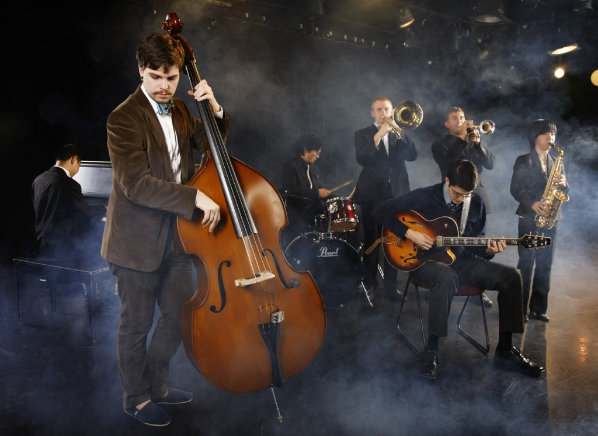

<!--- 
## Collaboration: jazz band improvising

musicians plays while listening closely to each others and adjusting constantly 

intense and practical only for small groups (2-7)

This is more like playing

--->

---

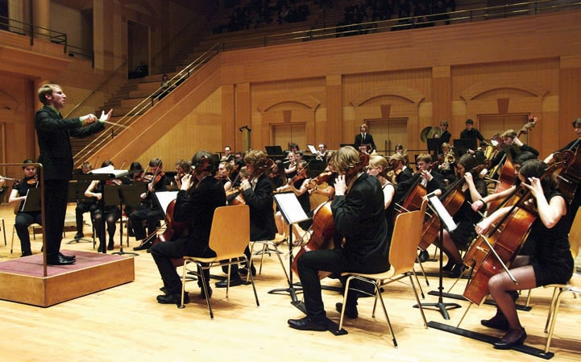

<!--- 

# Cooperation : orchestra

The musicians plays the same partition. A conductor helps to make cooperation smoother 

image source: https://upload.wikimedia.org/wikipedia/commons/e/e6/Concert_orchestre_symphonique_Arsenal_Metz.jpg

Works well but becomes difficult as the group grows, optimum below 25 people, requires conductors, managers, leader beyond that point.

This is more like playing a game (with common game rules)

--->

---

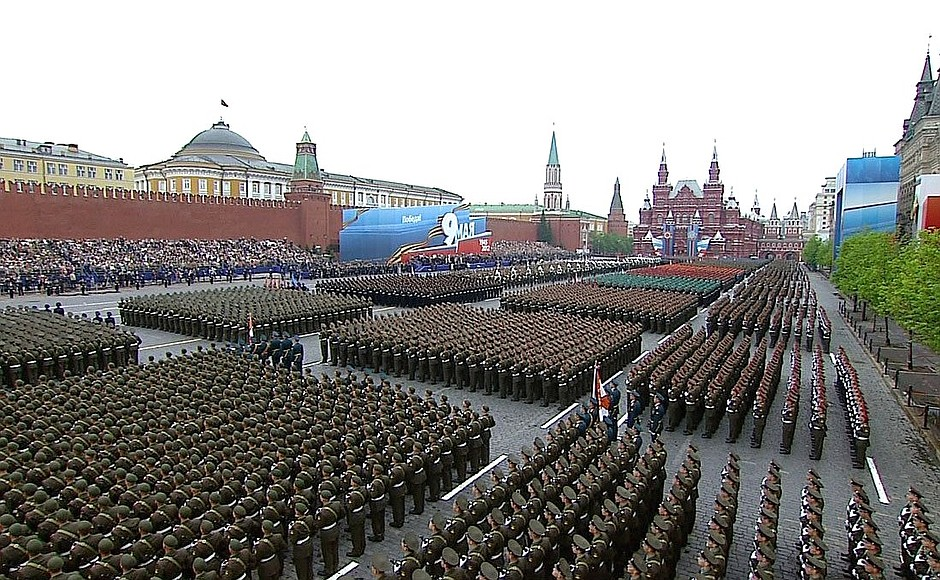

<!---
# Command and control

Works well for large groups, but uniformize individuals.

This is not really a game anymore and individuals tend to be treated like machines

--->

---

# Pyramidal hierarchy and competitive models

----
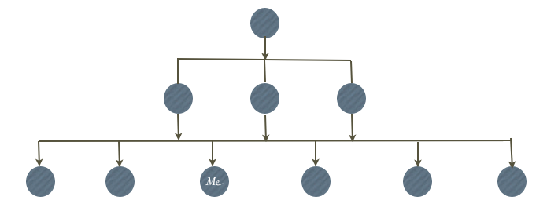

---

# Consensus-based hierarchy and cooperative models

----

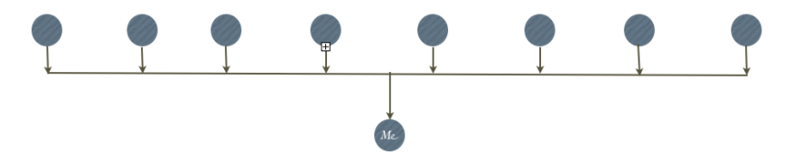

---

# Pyramidal and consensus based hierarchy are models of *a priori* control

<!--- 

by default nothing is allowed or visible, there is a need for an authorization of the boss or the group.

--->

---

# Any alternatives ?

---

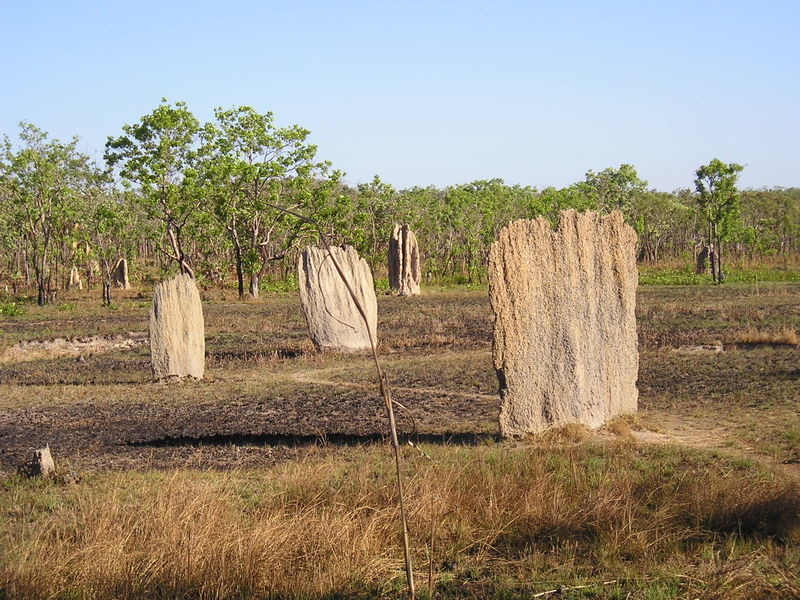

---

# Termite leaders ?

---

# Termite counsel ?

<!---
When termites construct their nests, they use predominantly indirect communication. No single termite would be in charge of any particular construction project. Individual termites react rather than think, but at a group level, they exhibit a sort of collective cognition. Specific structures or other objects such as pellets of soil or pillars cause termites to start building. The termite adds these objects onto existing structures, and such behaviour encourages building behaviour in other workers. The result is a self-organised process whereby the information that directs termite activity results from changes in the environment rather than from direct contact among individuals. Source:
https://en.wikipedia.org/wiki/Termite#Communication

Source image: Photo taken by Bmdavll and posted under License GFDL

--->

---

# Stigmergy

>  Greek στίγμα stigma "mark, sign" and ἔργον ergon "work, action"

---

# Stigmergy

*“Stigmergy is a mechanism of indirect coordination between agents or actions. The principle is that the trace left in the environment by an action stimulates the performance of a next action, by the same or a different agent. In that way, subsequent actions tend to reinforce and build on each other, leading to the spontaneous emergence of coherent, apparently systematic activity.”*
Wikipedia

<!---
https://en.wikipedia.org/wiki/Stigmergy

--->

---

# Stigmergy in ant societies

<!---Image:
Par Mehmet Karatay — Travail personnel, CC BY-SA 3.0, https://commons.wikimedia.org/w/index.php?curid=2179109
--->

---

<!---

Notes :1) the first ant find a food source (F), using some path (a), then it comes back to the nest (N), laying a pheromone trail. 2) the ants follow one of the 4 possible paths, but the reinforcement of the trail make the shortest path more appealing. 3) the ants follow the shortest path, the pheromone trail of the longest ones evaporates.

Source: Johann Dréo https://commons.wikimedia.org/wiki/File:Aco_branches.svg?uselang=fr

Ants use the environment as a support of communication. They exchange information indirectly by laying pheromones, describing the state of their "work". The informaion exchanged has a local reach, only ants located where pheromones are layed can have access to it.

https://en.wikipedia.org/wiki/Ant_colony_optimization_algorithms

Consider each ant follows this simple rule:
- Leave nest and wander around randomly
- If you detect a pheromone trail then follow it
- If you bump into a resource
 - Pick it up
 - Deposit a pheromone trail behind you
 - Go back to nest
The pheromone trail is a signal left in the environment that other ants can follow
Over time it dissipates away leaving no trace

--->

---

<!---
Stigmergy produce complex structures

The video below shows an anthill dug out by researchers after been filled with concrete to fix its structure. The result is breathtaking.

https://www.youtube.com/watch?v=lFg21x2sj-M

--->
---
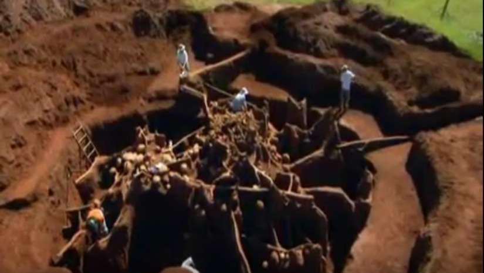

<!---
Stigmergy produce complex structures

The structure covers 50 square metres, is 8 metres deep and its building process required to move 40 tonnes of dirt.

Tunnels are optimised to ensure a good ventilation, but also the shortest routes, the structure has litterally underground "highways" and smaller routes connecting main chambers, garbage dumps, and mushroom gardens. In these gardens where temperature and humidity are controlled ants feed crushed leaves to a the mycelium they harvest later.

It looks like the structure has been built by some mad genius, but everything has been built by the collective intelligence of the colony behaving like a super-organism.

--->

---

# Examples of stigmergy

---

<!---

Basic models of flocking behavior are controlled by three simple rules:
Separation - avoid crowding neighbors (short range repulsion)
Alignment - steer towards average heading of neighbors
Cohesion - steer towards average position of neighbors (long range attraction)
With these three simple rules, the flock moves in an extremely realistic way
Again no central plan or control, communication via the environment

From David Halles: www.davidhales.com

--->

---

<!---
road traffic: 
--->

---

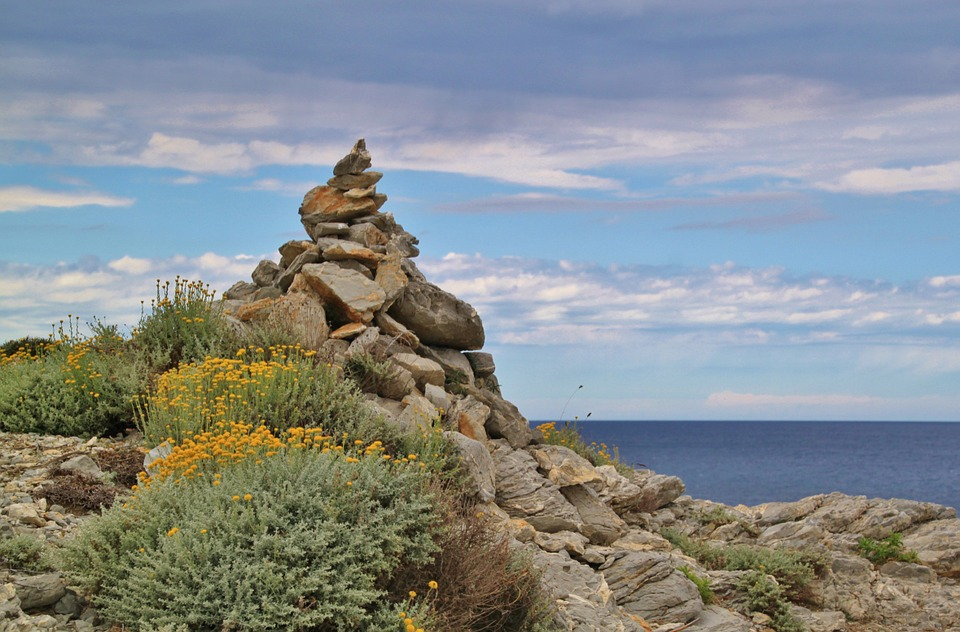

<!---

# Cairns
In modern times, cairns are often erected as landmarks, a use they have had since ancient times.
https://en.wikipedia.org/wiki/Cairn

--->

---

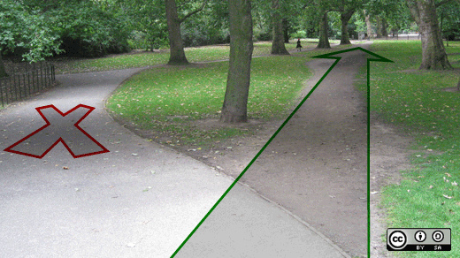

<!---

A desire path (formally referred to as desire line in transportation planning, also known as a game trail, social trail, herd path, cow path, goat track, pig trail or bootleg trail) can be a path created as a consequence of erosion caused by human or animal foot-fall or traffic. The path usually represents the shortest or most easily navigated route between an origin and destination. Width and erosion severity can be indicators of how much traffic a path receives. Desire paths emerge as shortcuts where constructed ways take a circuitous route, have gaps, or are non-existent.

https://en.wikipedia.org/wiki/Desire_path

--->

--- 

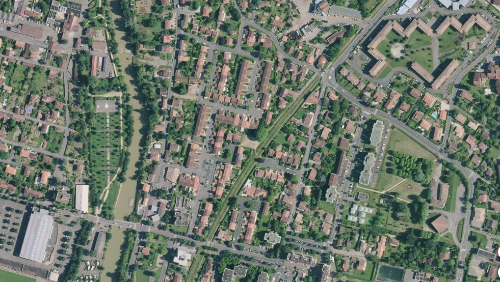

<!---
position of building and other landscape features acts as a trace for future building acts. Here one can see the remaining space left after the railway track was removed. building and property have adapted and although the track is not there anymore there is a remaining scar through the neighbourhood.
--->

---

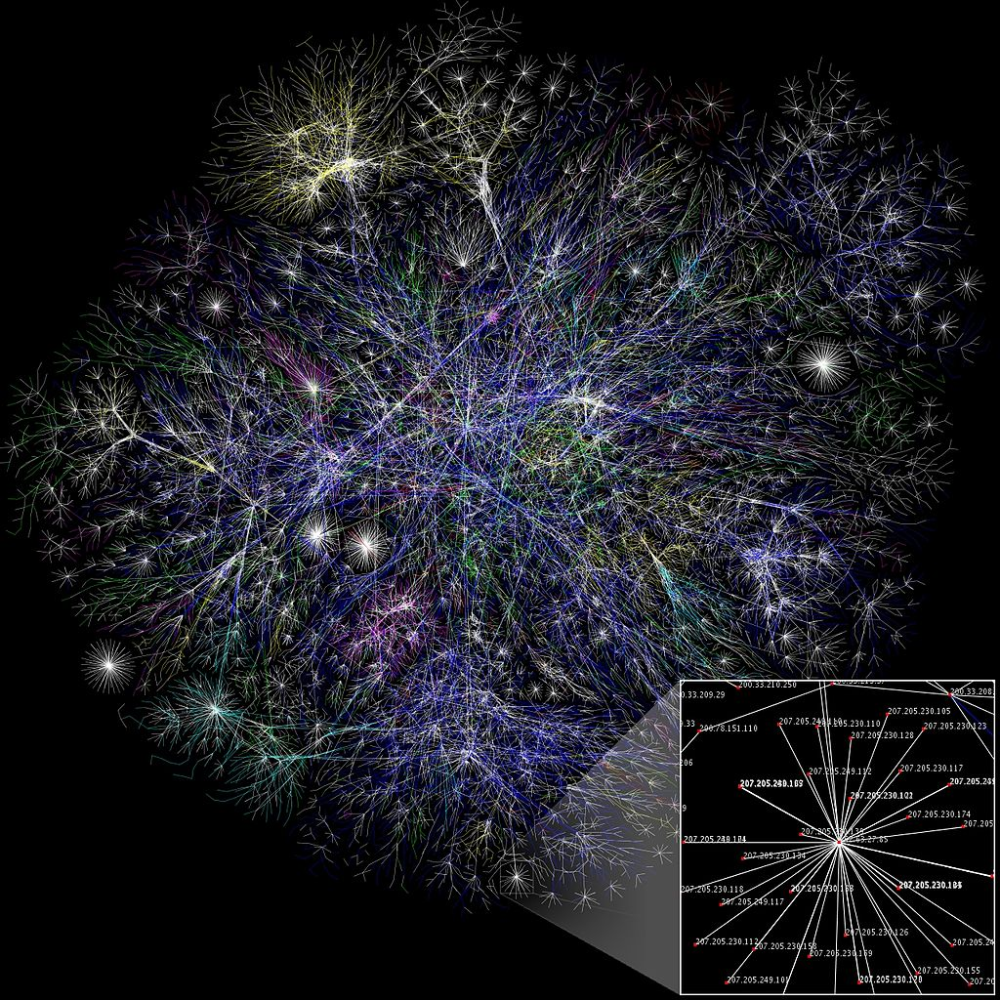

<!---
The structure of the Internet. Although part of its infrastructure were planned, most of it grew organically without any central planning.
--->

---

<!---
# Free software communities 

Linux, WordPress, Firefox … free software projects have now become mainstream. 

--->

---

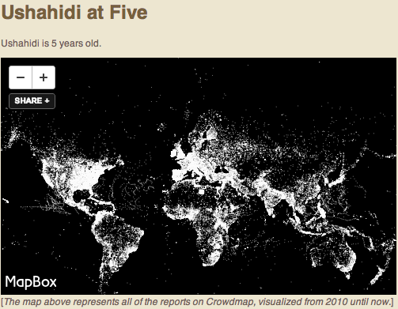

---

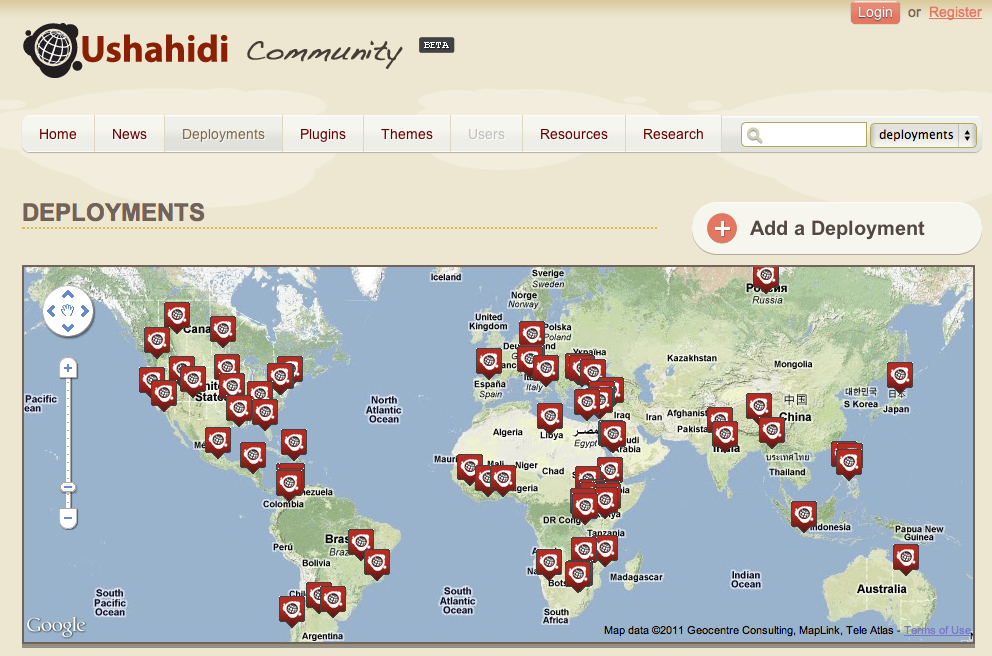

<!---
# Ushahidi crowdmapping platform

Ushahidi was studied as a stigmergic system. Ushahidi is an open source crowdmapping platform that allows users to collect, aggregate and map data during crises and emergency situations.

Ushahidi development is remarkable for several reasons:
- Ushahidi first release was developped and put up in a week
- the systeme was largely developped in Kenya, by kenyans, with limited technical ressources and infrastructures.
- few days after its launch, Ushahidi was used by thousands.
- Ushahdi was built by an ad-hoc self organized virtual team using modular tools that were mashed-up
- ushahidi has spread and been used in several crisis, election monitoring, human right advocacy since then (60 000+ deployments)

https://community.crowdmap.com/

Stigmergic self-organization and the improvisation of Ushahidi Margery Doyle and Leslie Marsh
Janet Marsden

--->

---

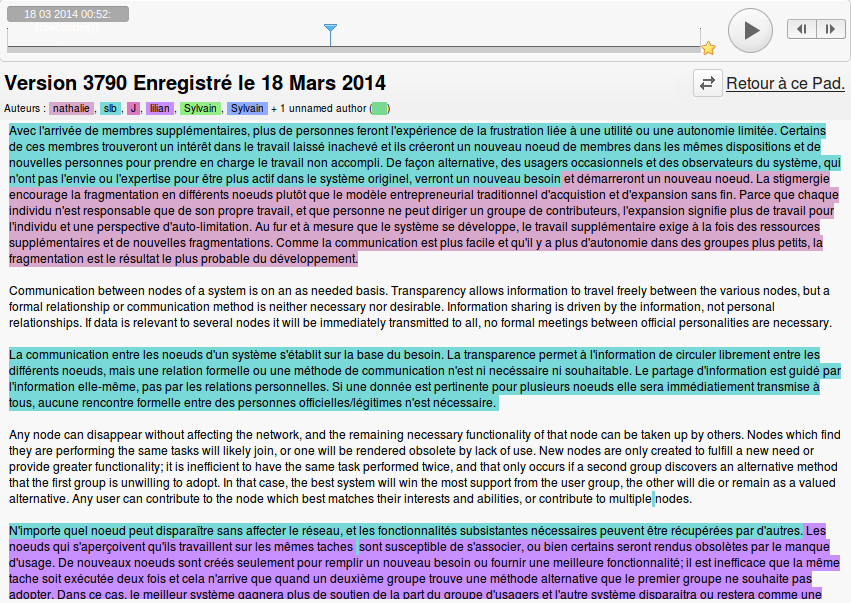

<!---

# Stigmergic translation

Heather Marsh's article on stigmergy was itself translated stigmergically, with almost no direct coordination and mostly through traces left on an etherpad: 
http://pad.imaginationforpeople.org/p/stigmergy

--->

---

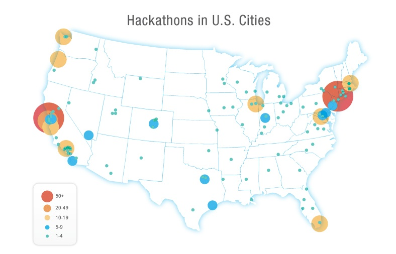

<!---
# Hackathons

No one organised the hackathons globally, yet hundreds have been organized so far.

--->

---

# #NuitDebout

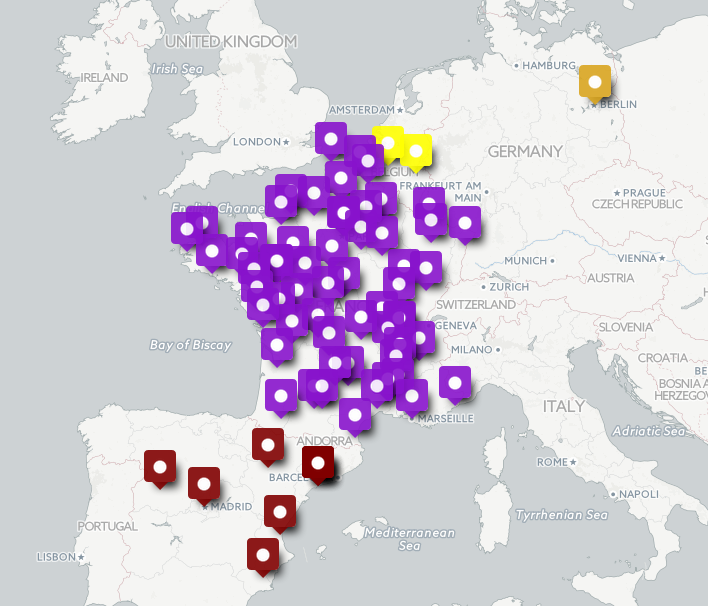

<!---
Inspired by spain's 15M movement and US's Occupy Wall Street, #Nuidebout has spread organically accross France and beyond.

https://framacarte.org/fr/map/nuitdebout_2186#5/46.260/13.135

--->

---

- disco soupe, 
- les anonymous / les indignés / #NuitDebout 
- - alternatiba

---

---

# Stigmergic model

---

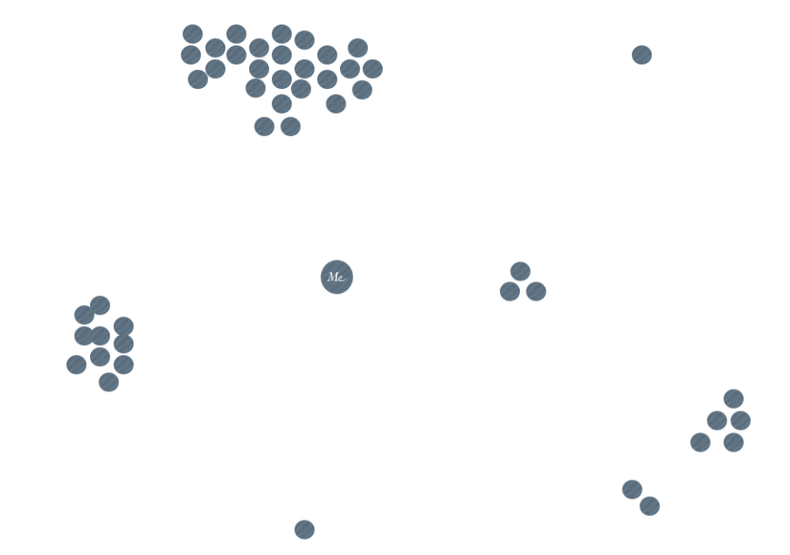

<!---
In the Stigmergy chart, all workers have full autonomy to create as they wish; the power of the user group is in the ability to accept or reject the work. Since there is no officially designated person to perform a task the users are free to create alternatives if they do not like what they are offered. Workers are free to create regardless of acceptance or rejection; in the chart below some work may be accepted by the largest group, some alternatives for a different user group, some only by a small group, and sometimes the worker will be alone with their vision. In all cases the worker is still free to create as they wish.

--->

---

# Process

--- 
## an idea is freely given

--- 
## The project is driven by the idea, 
<!---
not by a personality or
group of personalities.
--->

---

## No individual needs permission (competitive) or consensus (cooperative) to propose an idea or initiate a project. 
<!--- There is no need to discuss or
vote on the idea, if an idea is exciting or necessary it will
attract interest. The interest attracted will be from people
actively involved in the system and willing to put effort
into carrying the project further, not empty votes from
people with little interest or involvement.
--->

---

## Attracts contributive efforts, not empty votes

<!---Since the
project is supported or rejected based on contributed
effort, not empty votes, input from people with more
commitment to the idea will have greater weight.
--->
--- 

--- 
## Doesn't need group permission to tell them what system to work on or what part to contribute

<!--- s volontaires qui travaillent en collaboration à distance sont de plus en plus courants et concurrencent grandes entreprises et institutions pourtant richement dotés en moyens humains et financiers.

C’est le mode de travail des communautés du libre qui a inspiré Mark Ellliot, auteur d’une publication de référence sur la stigmergie comme cadre intellectuel pour la collaboration dans les grand groupes. (Lire: Stigmergic Collaboration: A Theoretical Framework for Mass Collaboration; Phd,2007)

http://mark-elliott.net/blog/?page_id=24%20

--->

# Stigmergic model

---

<!---
In the Stigmergy chart, all workers have full autonomy to create as they wish; the power of the user group is in the ability to accept or reject the work. Since there is no officially designated person to perform a task the users are free to create alternatives if they do not like what they are offered. Workers are free to create regardless of acceptance or rejection; in the chart below some work may be accepted by the largest group, some alternatives for a different user group, some only by a small group, and sometimes the worker will be alone with their vision. In all cases the worker is still free to create as they wish.

--->

---

---

---

# Can we promote the emergence of stigmergic behaviours ?

---

# Wikipedia as a stigmergic system 

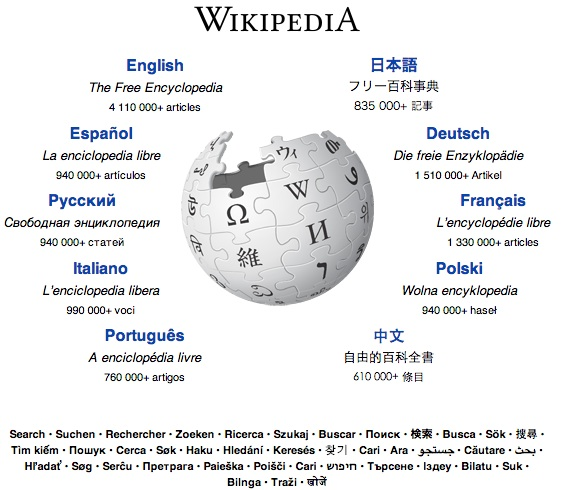

<!---
I have look into Wikipedia as a stigmergic system (indirect coordination via traces left in the environment) and identified several key principles 

--->

---

# Superordinate goal

> « Imagine a world in which every single person on the planet is given free access to the sum of all human knowledge. That's what we're doing. » – Vision of the Wikimedia Foundation

<!--- The vision of the Wikimédia foundation is a good example of superordinate goal 

https://en.wikipedia.org/wiki/Wikipedia:Purpose

--->

---

# Simple rules

Wikipedia five pillars

    Wikipedia is an encyclopedia
    Wikipedia is written from a neutral point of view
    Wikipedia is free content that anyone can use, edit, 
    and distribute
    Editors should treat each other with respect and civility
    Wikipedia has no firm rules

<!--- Wikipedia has few simple rules but these are essential to the governance of the project 

https://en.wikipedia.org/wiki/Wikipedia:Five_pillars
--->

---

# Leave some traces/change the environment to make actions visible

---

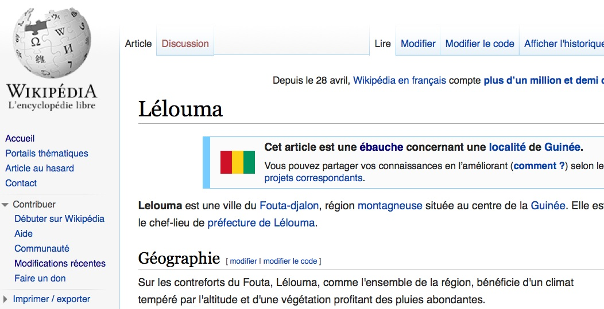

<!--- 

a stub on wikipedia.

The size of an article is a first signal to encourage others to improve the article.

--->

---

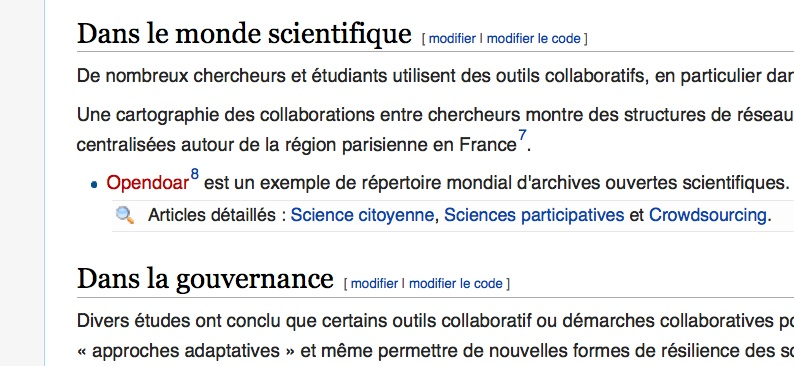

<!---

a red link signals that the linked page  doesn't exist yet. The link was placed as a call to action to make it easy for others to create the missing page.

--->

---

# *a priori* openness / authorization / transparency 

---

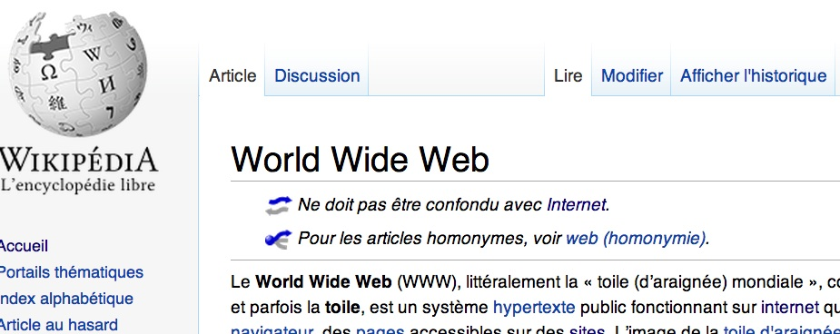

---

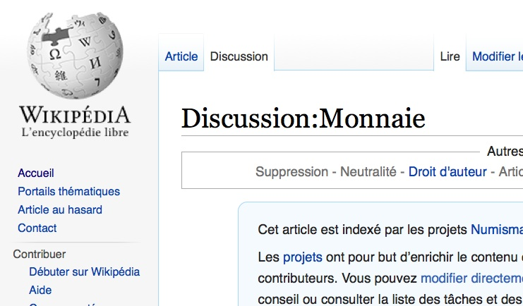

---

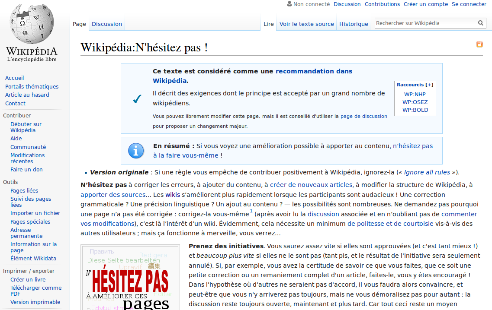

---

# Free licence usage

---

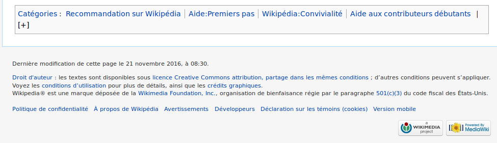

---

---

# Self-allocation of tasks

<!---
On Wikipedia anyone can freely work on almost any task: whether editing one of the millions of articles, improve the software, make a donation, welcome newbies or help to solve conflicts within the community, there are numerous possibilities of contibutions.

--->

---
# Large number and large diversity of agents

<!--- 

Keep in mind that, although there is global diversity (several languages and cultures), Wikipedia suffers from a disproportion of young western males. this explains why the articles on video games are so exhaustive whereas other encyclopedic topics are still incomplete.

This can also be a problem to integrate newcomers, other cultural groups, or experts who might feel excluded. Improving the diversity of contributors remains a challenge for Wikipedia.

---> 

---

# Work step by step / iteratively 

---

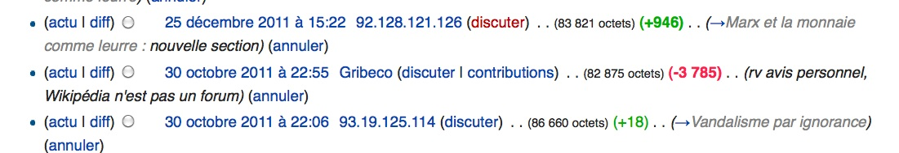

---

# *a posteriori* Control

---

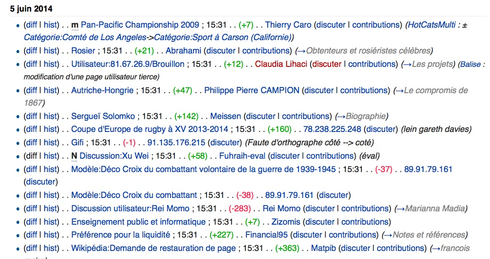

<!---

Recent changes and History systems records the differents versions and allow page by page or encyclopedia wide controls by the whole community.

--->

---

# Critical tasks management

---

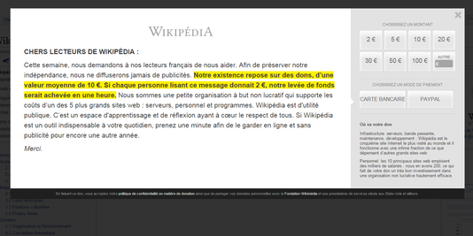

<!---

Some tasks are not critical for the community (if an article is incomplete, it won't harm the project) other tasks are. If the servers go down or if the domain name is not renewed, this will have a strong impact on the project.

To ensure critical tasks are taken care of, a non-profit organization the Wikimedia foundation was set up. This structure takes care of critical tasks (collect donations to pay for the hosting, maintenance or other developments of the project, communicate about the project, ...).

--->

---

# Accept forks and parallel branches

<!---

In my set of principles, this one is the least applied. Since Wikipedia is an encyclopedia, there has to be only one version of an article with a neutral point of view and multiple branches can't co-exist. This can be a problem for complex topics where having several subjective point of view could be more appropriate than one neutral point of view.

However there is often a difference in one article written in different languages, so one could see the various local wikipedia as different parallels branches. This seems to be an underuse aspect of Wikipedia and one could imagine mechanisms to take advantage of this diversity.

--->

---

Github as a stool for stigmergy

When you work, leave an artifact somewhere where others can find it.

Example of my work:

leaving some traces on github, twitter, mastodon
so that others can follow the trail, modify and fork easily

example of tis talk, pattern language, ...

---

# Stigmergy is ...

*if you slept here is the TlDr*

<!---
(too long didn't read)
--->

--- 
##  a mechanism of indirect coordination 

--- 
## a self-organized system

---

## a loop : action -> trace -> action -> ...

--- 

## centered on individual choice and action 

---

## a mechanism producing complex structures 

---

## emerging when certain conditions are present

---

## References / sources

Stigmergy, Heather Marsh 2012
https://georgiebc.wordpress.com/2012/12/24/stigmergy-2/

Stigmergic self-organization and the improvisation of Ushahidi (Janet Marsden, 2013)

Stigmergic Collaboration: A Theoretical Framework for Mass Collaboration; Phd,2007)

http://mark-elliott.net/blog/?page_id=24%20

Self-organization in Communicating Groups:
the emergence of coordination, shared references and collective
intelligence
Francis Heylighen, 2008.

Francis Heyl

---

## More ...
- http://lilianricaud.com/
- http://github.com/lilianricaud
- lilious@framapiaf.org (#JoinMastodon !)

---

# Valve, entreprise sans manager

<!---

Valve est une entreprise  qui produits des jeux vidéos à succès. Entreprise sans chefs,  elle clame avoir une meilleure rentabilité par employé que Google, Amazon ou Facebook.

Chez Valve, les équipes s’auto-organisent, n’importe qui peut suggérer une idée, et choisir librement sur quelle tache travailler (open allocation), les meneurs sont choisis par leur pairs, les salaires décidés par les confrères.

Notez que Wikipedia a une section sur le « Valve time », le fait que les produits de Valve soient toujours en retard par rapport à la date annoncée. Cependant malgré ces délais fréquents, l’entreprise est reconnue pour la très grande qualité de ses produits et est l’origine de certains des plus grands succès du jeu vidéo. Voir:

    http://www.lilianricaud.com/web-strategy/meet-valve-the-company-managing-without-managers/
    http://www.gamasutra.com/view/feature/131815/the_cabal_valves_design_process_.php?print=1
--->

---

# Le management autogéré de Github

<!---

Open Allocation

At GitHub, people work on an open allocation (http://www.forbes.com/sites/quora/2012/11/26/what-is-open-allocation/) basis. Unlike traditional companies where projects are assigned top-down, GitHubbers tackle whatever projects they want, without any formal requests
or managerial interference.
    http://www.fastcolabs.com/3020181/open-company/inside-githubs-super-lean-management-strategy-and-how-it-drives-innovation
--->

---

--->

---

# shan zhai innovation ecosystem

<!---

Originellement le terme Shan Zhai était utilisé pour définir un bastion de bandits chinois hors du contrôle des gouvernements locaux. Ce terme désigne maintenant les faux, les contrefaçons ou copies de produits occidentaux fabriqués localement qui inondent le marché chinois.

Aujourd’hui les Shan Zhai, c’est un écosystème d’innovation unique et extrêmement performant avec 30 000 entreprises et des communautés locales collaborant à la chaine de valeur dans la région industrielle de Shen Zhen.

Les Shan Zhai ont plusieurs principes dont deux importants pour la stigmergie:

    Partager le plus d’informations pour que l’écosystème puisse ajouter de la valeur à votre processus.
    Ne rien concevoir ex nihilo : s’appuyer sur ce que les autres ont déjà fait.

Voir à ce sujet:

    http://www.internetactu.net/2012/07/04/un-ecosyteme-d%E2%80%99innovation-singulier-les-shan-zhai/
--->

---

--->

---
 
# Open Space Technology
<!---

Open space seems to have several stigmergic principles:
- superordinate goals
- simple rules
- openness
- self-allocation
- forks

 
--->
---

# Twitter and user-generated content

<!---

A representative example is Twitter, which has "paved" a number of desire paths by integrating them into the service, including @ mentions, hashtags, and group discussions, although not always precisely mimicking the behaviors of users.

Several innovations of Twitter initially came from users and outside developpers and were integrated later by the company:
- real-time serach engine
- tweetdeck
- social innovation such as retweets, #hashtags

Short public messages with asymetric conversations Twitter is a good platform to leave traces for stigmergic cooperation (but don't forget to #JoinMastodon)

--->

---

# ~~Twitter and user-generated content~~ 
# #JoinMastodon

---

