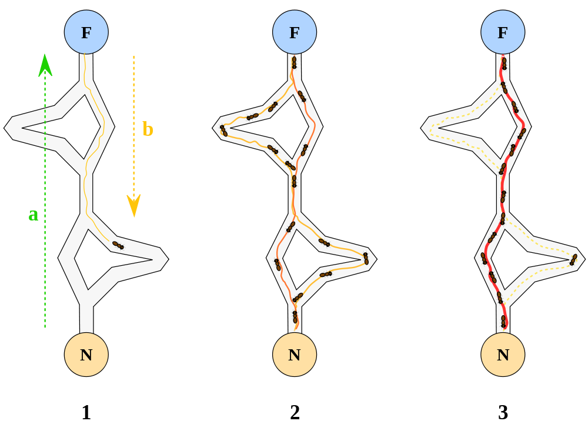

# Stigmergy, self-organization and large scale collaboration

## Ncraft 2017

CC-BY-SA Lilian RICAUD

<!-- footer:stigmergy - CC-BY-SA Lilian RICAUD -->

---

---

<!--- 

## orchestra

source de l'image: https://upload.wikimedia.org/wikipedia/commons/e/e6/Concert_orchestre_symphonique_Arsenal_Metz.jpg

--->

---

<!--- 
improvisation d'un jazz band: les musiciens ne jouent pas une partition prédéfinie, mais sont en écoute les un des autres pour collaborer.

--->

---

---

# Hierarchie pyramidale (modèle compétitif)

----

---

# Hierarchie de consensus (modèle coopératif)

----

---

# Hierachie pyramidale et hierarchie de consensus: 

## 2 modèles de controle *a priori*

<!--- 

--->

---

# Hierachie pyramidale et hierarchie de consensus: 

---

---

# Termite leaders ?

---

# Termite counsel ?

<!---
When termites construct their nests, they use predominantly indirect communication. No single termite would be in charge of any particular construction project. Individual termites react rather than think, but at a group level, they exhibit a sort of collective cognition. Specific structures or other objects such as pellets of soil or pillars cause termites to start building. The termite adds these objects onto existing structures, and such behaviour encourages building behaviour in other workers. The result is a self-organised process whereby the information that directs termite activity results from changes in the environment rather than from direct contact among individuals. Source:
https://en.wikipedia.org/wiki/Termite#Communication

Source image: Photo prise par Bmdavll et mise à disposition sous License GFDL

--->

---

# Stigmergie

> grecs στιγμα (stigma) « marque, signe » et εργον (ergon) « travail, action »

---

# stigmergie

> La stigmergie est une méthode de communication indirecte dans un environnement émergent auto-organisé, où les individus communiquent entre eux en modifiant leur environnement.

Wikipedia

---

# Stigmergie chez les fourmis

<!---Image:
Par Mehmet Karatay — Travail personnel, CC BY-SA 3.0, https://commons.wikimedia.org/w/index.php?curid=2179109
--->

---

<!---

Notes : 1) la première fourmi trouve la source de nourriture (F), via un chemin quelconque (a), puis revient au nid (N) en laissant derrière elle une piste de phéromone (b). 2) les fourmis empruntent indifféremment les 4 chemins possibles, mais le renforcement de la piste rend plus attractif le chemin le plus court. 3) les fourmis empruntent le chemin le plus court, les portions longues des autres chemins voient la piste de phéromones s'évaporer.

Source: https://commons.wikimedia.org/wiki/File:Aco_branches.svg?uselang=fr

Plus d'informations:

Les fourmis utilisent l’environnement comme support de communication : elles échangent indirectement de l’information en déposant des phéromones, le tout décrivant l’état de leur « travail ». L’information échangée a une portée locale, seule une fourmi située à l’endroit où les phéromones ont été déposées y a accès.

https://fr.wikipedia.org/wiki/Algorithme_de_colonies_de_fourmis

--->

---

<!---
La stigmergie produit des structures complexes

La vidéo ci-dessous montre une fourmilière déterrée par des chercheurs après avoir été remplie de béton pour figer sa structure. Le résultat est à couper le souffle.

https://www.youtube.com/watch?v=lFg21x2sj-M

--->
---

<!---
La stigmergie produit des structures complexes

La structure couvre 50 mètres carrés, descend à 8 mètres de profondeur et lors de sa conception a nécessité le déplacement de 40 tonnes de terre.

Les tunnels sont conçus de façon optimales pour assurer une bonne ventilation mais aussi la route la plus courte,  la structure comportant de véritables  « autoroutes » souterraines et des routes plus petites, connectant des chambres principales, des fosses à ordures, et des « jardins à champignons » où la température et l’humidité sont contrôlées et où les fourmis nourrissent de feuilles broyées un  mycélium qu’elles récoltent ensuite.

On dirait que la structure a été conçue par un architecte génial, mais tout a été fait par l’intelligence collective de la colonie qui se comporte comme un super-organisme.

--->

---

# Stigmergy is ...

 
--- 
##  a mechanism of indirect coordination 

--- 
## a self-organized system

---

## a loop : action -> trace -> action -> ...

--- 

## centered on individual choice and action 

---

## a mechanism producing complex structures 

---

# Stigmergy in human systems 

---

---

# Stigmergic model

---

---

##  *a priori* openness

--- 

## freedom to create regardless of acceptance or rejection

--- 

## freedom to accept or reject a work or a task

--- 

## freedom to create an alternative

---

# Process

--- 
## an idea is freely given

--- 
## The project is driven by the idea, 
not by a personality or
group of personalities. 

---
## No individual needs permission (competitive) or consensus (cooperative) to propose an idea or initiate a project. 
<!--- There is no need to discuss or
vote on the idea, if an idea is exciting or necessary it will
attract interest. The interest attracted will be from people
actively involved in the system and willing to put effort
into carrying the project further, not empty votes from
people with little interest or involvement.
--->
---

## Attracts contributive efforts, not empty votes

<!---Since the
project is supported or rejected based on contributed
effort, not empty votes, input from people with more
commitment to the idea will have greater weight.
--->
--- 

--- 
## No need group permission to tell them what system to work on or what part to contribute

--- 

---

# STIGMERGY PRINCIPLES

list of principles

Wikipedia examples

then pattern language at the end

---

# STIGMERGY PATTERN LANGUAGE

(non exhaustifs)

---

# RADICAL OPENNESS
<!---

Without perceptibles traces no stigmergy can happen.

therefore, 

Favor openess "a priori" (from the earlier), promote transparency, with large access to information and data.

To provide data that can be reused and allow stigmergy, use FREE LICENCES

--->

---

# FREE LICENCES

<!---
When data is locked under standard copyright, it can be reused freely, there's a need of permission. Even when data is freely given, too often it is not explicitly allowing reuse. Moreover when made available, the data can be offered in a format that makes it difficult to reuse. All this creates friction. Agents can't be certain they will be able to perform their action on the long term their effort so this can't allow a sustainable stigmergic process to happen.

Therefore, 

Put all your data under free licences that allow reuse, including commercial. Provide the data in a format that make it easy to reuse (STANDARDS)
--->

---

# DIVERSITY OF AGENTS

<!--- Avoir un grand nombre et une grande diversité d'agents

--->
---

# SELF-ALLOCATION

Avoir une auto-allocation des taches

autonomie des agents et équipes émergentes

---

# ORGANIC GROWTH

<!---

Close to Alexander's structure-preserving transformation, Hundertwasser's vegetative method.

Allow organic growth of the project with PROJECT dividing/differentiating (DIFFERENTIATION) into NODES as it grows.

This is a step-by-step growth (ITERATIONS) where at each step the current structure is preserved and extended. Reverting back to one step before is easy but it's hard/costly to go back to previous iterations, it's important to make the correct choice at each step or quickly revert

--->
---

# FORKS

<!---
Accept and favor forks and development of parallele branches.

keep in mind INTEROPERABILTY AND STANDARDS

--->
---

# *a posteriori* control mechanisms

Utiliser des mécanismes de contrôle *a posteriori*

---

# CRITICAL TASKS

Use mechanisms to make sure critical tasks are taken care of.

---

# ITERATIONS

<!---
Fonctionner par étapes / itérations / cycles successifs

--->

---

# SIMPLE RULES

<!--- 
simple rules of interactions

--->

---

# SUPERORDINATE GOAL

<!---

The superordinate goal is the social object around which NODES can form.

A super ordinate goal is a way to align easily around a common intent (you either share the intent or not, therefore you follow it or you don't. 

https://en.wikipedia.org/wiki/Superordinate_goals

--->

---

# ENVIRONMENT

<!--- Je parlerai d’environnement pour décrire l‘espace de travail qui peut être physique et/ou virtuel. Certains auteurs préfèrent parler de milieu (medium en anglais).

Je parlerai d’agents, à savoir les acteurs qui effectuent un travail ou une action dans le système stigmergique. Notez qu’un agent peut être une personne mais aussi une organisation.

Par organisation j’entends n’importe quel groupe humain structuré que ce soit une entreprise, une association, une institution, ces organisations pouvant elles mêmes fonctionner sur un modèle hiérarchique ou de consensus.

--->

---

# NODES

<!---
Enfin les noeuds sont les groupes de travail regroupant un nombre plus ou moins grand d’agents autour d’une tache. Un noeud peut se cliver en différentes branches qui, bien que travaillant sur la même tache, utilisent deux approches différentes en parallèle.

--->

---

# Wikipedia as a stigmergic system 

---

# Superdordinate goal

> « Imagine a world in which every single person on the planet is given free access to the sum of all human knowledge. That's what we're doing. » – Vision of the Wikimedia Foundation

<!--- The vision of the Wikimédia foundation is a good example of superordinate goal --->

---

# Simple rules

Principes fondateurs de Wikipedia

    Wikipedia is an encyclopedia
    Wikipedia is written from a neutral point of view
    Wikipedia is free content that anyone can use, edit, 
    and distribute
    Editors should treat each other with respect and civility
    Wikipedia has no firm rules

<!--- Wikippedia has few simple rules but these are essential to the governance of the project --->

---

# Leave some traces/change the environment to make actions visible

---

<!--- 

a stub on wikipedia.

The size of an article is a first signal to encourage others to improve the article.

--->

---

<!---

a red link signals that the linked page  doesn't exist yet. The link was placed as a call to action to make it easy for others to create the missing page.

--->

---

# *a priori* openness / authorization / trasnparency 

---

---

---

---

# Free licence usage

---

---

---

# Auto allocation des tâches

<!---
Sur Wikipédia,chacun est libre de se positionner sur à peu près n’importe quelle tache.

Que ce soit éditer les très nombreuses pages, ajouter des photos, améliorer le logiciel, faire un don, accueillir les nouveaux ou aider à résoudre les conflits en interne, il existe de nombreuses façon de contribuer spontanément.

--->

---
# Grand nombre et grande diversité d’agents

<!--- 

Notez que s’il y a une certaine diversité globale (nombreuses langues et cultures), Wikipédia souffre encore d’une disproportion en faveur d’une population de jeunes adultes masculins occidentaux, ce qui explique que les pages sur les jeux vidéos soient très complètes alors que d’autres sujets plus encyclopédiques restent mal traités.

Ceci peut aussi poser parfois problème au niveau de l’intégration des nouveaux ou d’autres groupes culturels qui peuvent se sentir exclus. Accroitre la diversité des contributeurs reste un enjeu pour Wikipédia.

---> 

---

# Fonctionner par étapes / itérations / cycles successifs

---

---

# Contrôle a posteriori

---

<!---

Le système d’historique qui enregistre et permet de comparer les différentes versions des pages facilite ce contrôle par la communauté page par page ou sur l'ensemble de l'encyclopedie.

--->

---

# Gestion des taches critiques / essentielles

---

<!---
Si certaines taches ne sont pas critiques pour l’encyclopédie (si un article est incomplet, cela ne nuit pas à l’avenir du projet), d’autres en revanche sont essentielles. Si les serveurs qui hébergent le projet tombent en panne ou que le nom de domaine n’est pas renouvelé, cela aura un grave impact sur le projet.

Pour assurer la gestion des taches critiques (collecte des fonds qui servent à payer l’hébergement et d’autres travaux servant au développement de l’encyclopédie) a été mis en place la Wikimedia Foundation, un organisme à but non lucratif.

L’objectif de la Wikimedia Foundation est de « promouvoir la croissance et le développement de projets de diffusion du savoir libre fondés sur le principe du wiki, et d’en distribuer le contenu publiquement et gratuitement ».

Elle ne possède aucun droit éditorial sur les contenus proposés sur le site de Wikipédia mais organise les campagnes de financement et redistribue les dons des utilisateurs pour faire tourner les taches critiques des projets (hébergement des différents projets Wikimedia multilingues, développements informatiques, actions de communication…).

--->

---

# Accepter les branches parallèles

<!---

Par rapport à ma grille de principes, celui ci ne semble pas être respecté, puisque que chaque article a une version unique et qu’il n’est pas possible de créer une version parallèle d’un article.

Cela tient au fait que Wikipédia ayant pour mission de fournir une encyclopédie objective/neutre et universelle, une seule version de chaque sujet existe. Ceci peut parfois être un problème ou un sujet complexe ne fait pas consensus et la page doit pourtant offrir une version unique et objective.

Pourtant, on pourrait imaginer une architecture où chaque sujet pourrait avoir différentes pages subjectives qui permettrait au lecteur d’avoir non pas une version unique et « objective » de la vérité, mais plusieurs versions ouvertement subjectives, qui pourraient peindre un tableau plus réaliste de la vérité.

Notez cependant qu’il est courant qu’un même article rédigé dans différentes langues montre des différences et des spécificités liées à la culture, au niveau de connaissance… On peut donc aussi voir les différentes Wikipédias multilingues comme des branches parallèles qui peuvent se nourrir mutuellement. C’est une richesse sous exploité à l’heure actuelle. On pourrait imaginer la mise en place de mécanismes pour tirer parti de cette diversité.

--->

--- 

# OZON ?

---

# Autres exemples en vrac

---

<!---
essaim d'oiseau: un groupe d'oiseau en vol, l'ensemble se comporte comme un super-organisme
--->

---

<!---
traffic routier: 
--->

--- 

<!---
agencement d'une ville
--->

---

<!---
Internet
--->

---

# Traduction stigmergique

<!---
L'article sur la stigmergie de heather Marsh a lui même été traduit de manière stigmergique, sans concertation particulière entre les participants et principalement via les traces laissées sur le pad:
http://pad.imaginationforpeople.org/p/stigmergy

--->

---

# Les communautés du libre

<!---

Les communautés du libre

Linux, Wikipédia, WordPress, Firefox … longtemps marginaux, les projets rassemblant des volontaires qui travaillent en collaboration à distance sont de plus en plus courants et concurrencent grandes entreprises et institutions pourtant richement dotés en moyens humains et financiers.

C’est le mode de travail des communautés du libre qui a inspiré Mark Ellliot, auteur d’une publication de référence sur la stigmergie comme cadre intellectuel pour la collaboration dans les grand groupes. (Lire: Stigmergic Collaboration: A Theoretical Framework for Mass Collaboration; Phd,2007)

http://mark-elliott.net/blog/?page_id=24%20

--->

---

# Valve, entreprise sans manager

<!---

Valve est une entreprise  qui produits des jeux vidéos à succès. Entreprise sans chefs,  elle clame avoir une meilleure rentabilité par employé que Google, Amazon ou Facebook.

Chez Valve, les équipes s’auto-organisent, n’importe qui peut suggérer une idée, et choisir librement sur quelle tache travailler (open allocation), les meneurs sont choisis par leur pairs, les salaires décidés par les confrères.

Notez que Wikipedia a une section sur le « Valve time », le fait que les produits de Valve soient toujours en retard par rapport à la date annoncée. Cependant malgré ces délais fréquents, l’entreprise est reconnue pour la très grande qualité de ses produits et est l’origine de certains des plus grands succès du jeu vidéo. Voir:

    http://www.lilianricaud.com/web-strategy/meet-valve-the-company-managing-without-managers/
    http://www.gamasutra.com/view/feature/131815/the_cabal_valves_design_process_.php?print=1
--->

---

# Le management autogéré de Github

<!---

Github est une plateforme de collaboration pour développeurs, bâtie sur un projet open source (Git dont je reparlerai dans un prochain article). Github est une compagnie privée à but lucratif, mais elle a pris les pratiques du monde de l’open source et les appliquée à l’organisation de l’ensemble de l’entreprise.

Github utilise aussi l’ « open allocation » (choix des taches de façon autonome) et ses employés sont libres de s’attaquer à n’importe quel projet qui les intéresse sans demande formelle ou sans interférence managériale. Pour plus d’information sur le fonctionnement de Github lire cet excellent article:

    http://www.fastcolabs.com/3020181/open-company/inside-githubs-super-lean-management-strategy-and-how-it-drives-innovation
--->

---

# Poult, entreprise « libérée »

<!---

En France, l’entreprise de biscuiterie Poult utilise un management participatif original. Poult a décidé de sortir du management par objectifs et de supprimer quelques niveaux hiérarchiques, responsabiliser les équipes en les laissant gérer leurs plannings et en leur laissant la liberté et les moyens de prendre des initiatives.

Transparence, ouverture, fonctionnement en réseau, autonomisation des personnes, avec  possibilité pour n’importe qui de lancer un nouveau projet. Peut être pas de la stigmergie, mais peut être une entreprise où le modèle pourrait être développé avec succès.

Regarder cette présentation pour en savoir plus: https://www.youtube.com/watch?v=lcgerZTq640

--->

---

# L’écosystème des shan zhai

<!---

Originellement le terme Shan Zhai était utilisé pour définir un bastion de bandits chinois hors du contrôle des gouvernements locaux. Ce terme désigne maintenant les faux, les contrefaçons ou copies de produits occidentaux fabriqués localement qui inondent le marché chinois.

Aujourd’hui les Shan Zhai, c’est un écosystème d’innovation unique et extrêmement performant avec 30 000 entreprises et des communautés locales collaborant à la chaine de valeur dans la région industrielle de Shen Zhen.

Les Shan Zhai ont plusieurs principes dont deux importants pour la stigmergie:

    Partager le plus d’informations pour que l’écosystème puisse ajouter de la valeur à votre processus.
    Ne rien concevoir ex nihilo : s’appuyer sur ce que les autres ont déjà fait.

Voir à ce sujet:

    http://www.internetactu.net/2012/07/04/un-ecosyteme-d%E2%80%99innovation-singulier-les-shan-zhai/
--->

---

# Les MOOCs, cours massif ouverts en ligne

<!---

Les MOOCs, sont un nouveau modèles de ces cours ouverts en ligne où l’apprentissage se fait de manière auto-organisé, favorisant l’auto-apprentissage et la sérendipité.

S’il y a communication directe entre certains petits groupes de participants, une grosse partie de l’organisation se fait aussi via des traces laissés dans l’environnement en ligne. Voir:

    Travail collaboratif en ligne au sein d’un cours massif ouvert (Mooc)
    https://fr.wikipedia.org/wiki/Cours_en_ligne_ouvert_et_massif
   
--->

---
 
# Le forum ouvert
<!---

Le forum ouvert (en anglais « Open Space Technology » est un format de rencontre basée sur l’auto-organisation, la créativité et la liberté d’expression, l’objectif est de créer un climat favorisant l’initiative et l’apprentissage.

Dans le forum ouvert on retrouve plusieurs principes du modèle stigmergique, notamment l’autonomie des agents.

Lire:

    http://www.pratiques-collaboratives.net/Forum-Ouvert-une-presentataion-du-comment-faire.html
Twitter dopé par ses utilisateurs

Savez vous que de nombreuses innovations sur la plateforme de Twitter n’ont pas initiés pas l’entreprise, mais par les utilisateurs et développeurs externes ?

Certains des outils les plus utilisés aujourd’hui comme le moteur de recherche ou le logiciel de publication Tweetdeck, ont été à la base conçues par des développeurs externes, puis rachetés par l’entreprise.

Ceci a été rendu possible par la mise à disposition par Twitter des données sous une forme qui permet aux développeurs de bâtir spontanément des services sur la plateforme existante (des interfaces de programmation appellées APIs pour ceux qui connaissent).

De même des innovations sociales, les RT (retweets = faire suivre), les #hashtags viennent des usages des utilisateurs, et se sont spontanément popularisés avant d’être intégrées plus tard par l’entreprise comme des fonctionnalités bâties en dur dans la plateforme.

Twitter a eu l’intelligence (au moins a ses débuts, c’est moins vrai maintenant) d’utiliser cette innovation spontanée en l’incorporant dans la plateforme principale.

Concise, publique, asymétrique, la conversation elle même sur Twitter se prête à une coopération stigmergique.
La plateforme de crowdmapping Ushahidi

Plus récemment dans un article scientifique publié en 2013, la chercheuse Janet Marsden a étudié le développement de la plateforme logicielle de crowdmapping Ushahidi en la regardant sous un angle stigmergique.

Ushahidi est une plateforme open source qui permet de collecter, d’agréger et de cartographier de l’information en situation d’urgence ou de crise.

Le développement d’Ushahidi est remarquable pour plusieurs raisons:

    La version originale d’Ushahidi a été développée et mise en place en une semaine.
    Le système a été largement développée par des kenyans, au Kenya, un pays africain avec des ressources techniques et une infrastructure limitées.
    Quelques jours après son lancement, Ushahidi était utilisé par des milliers d’utilisateurs.

L’auteur explique que l’avancée des réseaux de communication distribués comme l’internet et les réseaux ubiquitaires ont rendus obsolète l’approche top-down de développement de logiciels.

A la place, les outils utilisés sont des composants modulaires adaptables, autogérés et combinés en mash-ups. De même les équipes de développement logiciels et les participants sont spontanées et ad-hoc, fonctionnant comme des organisations virtuelles.

L’environnement de travail qui facilite la coordination des agents est fourni par la plateforme logicielle Ushahidi, incluant ses composants, interfaces et leur affordance pour les participants (l’affordance est la capacité d’un système ou d’un produit à suggérer sa propre utilisation) .

Notez que Ushahidi s’est propagé de façon spontanée et a été depuis été utilisé dans de nombreux endroits dans le monde pour cartographier des situations de crises de façon participative.

Plus sur Ushahidi comme système stigmergique dans cet article très intéressant: Stigmergic self-organization and the improvisation of Ushahidi

 
--->
---

# Twitter dopé par ses utilisateurs

<!---

Savez vous que de nombreuses innovations sur la plateforme de Twitter n’ont pas initiés pas l’entreprise, mais par les utilisateurs et développeurs externes ?

Certains des outils les plus utilisés aujourd’hui comme le moteur de recherche ou le logiciel de publication Tweetdeck, ont été à la base conçues par des développeurs externes, puis rachetés par l’entreprise.

Ceci a été rendu possible par la mise à disposition par Twitter des données sous une forme qui permet aux développeurs de bâtir spontanément des services sur la plateforme existante (des interfaces de programmation appellées APIs pour ceux qui connaissent).

De même des innovations sociales, les RT (retweets = faire suivre), les #hashtags viennent des usages des utilisateurs, et se sont spontanément popularisés avant d’être intégrées plus tard par l’entreprise comme des fonctionnalités bâties en dur dans la plateforme.

Twitter a eu l’intelligence (au moins a ses débuts, c’est moins vrai maintenant) d’utiliser cette innovation spontanée en l’incorporant dans la plateforme principale.

Concise, publique, asymétrique, la conversation elle même sur Twitter se prête à une coopération stigmergique.
--->

---

# La plateforme de crowdmapping Ushahidi

<!---

Plus récemment dans un article scientifique publié en 2013, la chercheuse Janet Marsden a étudié le développement de la plateforme logicielle de crowdmapping Ushahidi en la regardant sous un angle stigmergique.

Ushahidi est une plateforme open source qui permet de collecter, d’agréger et de cartographier de l’information en situation d’urgence ou de crise.

Le développement d’Ushahidi est remarquable pour plusieurs raisons:

    La version originale d’Ushahidi a été développée et mise en place en une semaine.
    Le système a été largement développée par des kenyans, au Kenya, un pays africain avec des ressources techniques et une infrastructure limitées.
    Quelques jours après son lancement, Ushahidi était utilisé par des milliers d’utilisateurs.

L’auteur explique que l’avancée des réseaux de communication distribués comme l’internet et les réseaux ubiquitaires ont rendus obsolète l’approche top-down de développement de logiciels.

A la place, les outils utilisés sont des composants modulaires adaptables, autogérés et combinés en mash-ups. De même les équipes de développement logiciels et les participants sont spontanées et ad-hoc, fonctionnant comme des organisations virtuelles.

L’environnement de travail qui facilite la coordination des agents est fourni par la plateforme logicielle Ushahidi, incluant ses composants, interfaces et leur affordance pour les participants (l’affordance est la capacité d’un système ou d’un produit à suggérer sa propre utilisation) .

Notez que Ushahidi s’est propagé de façon spontanée et a été depuis été utilisé dans de nombreux endroits dans le monde pour cartographier des situations de crises de façon participative.

Plus sur Ushahidi comme système stigmergique dans cet article très intéressant: Stigmergic self-organization and the improvisation of Ushahidi
http://www.inf.ucv.cl/~bcrawford/Cuesta_Olivares/Stigmergy/1-s2.0-S138904171200040X-main.pdf

--->
 

---

# autre exemples

- disco soupe, 
- les anonymous / les indignés / #NuitDebout 

---

# A suivre ...
