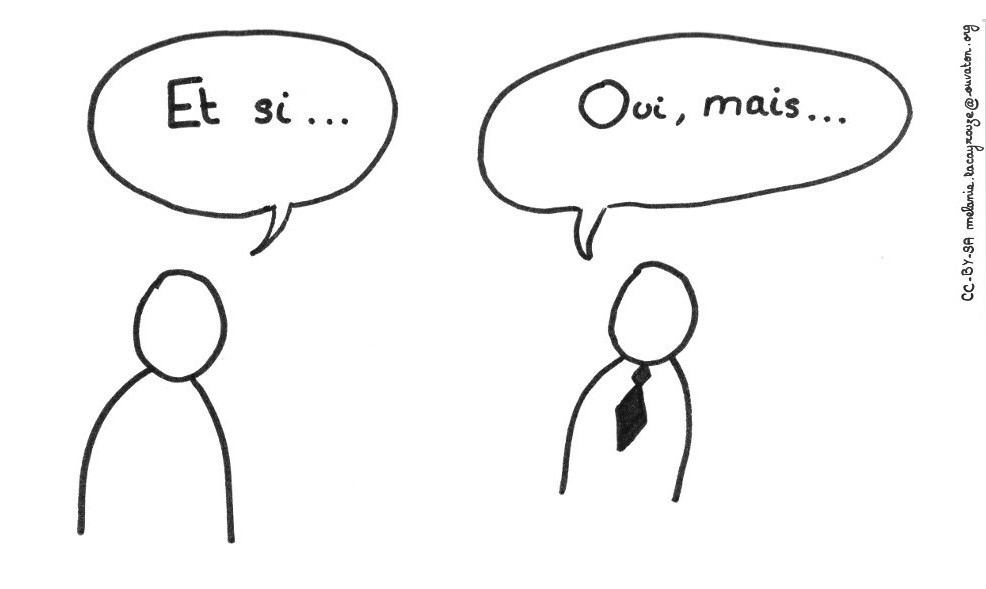
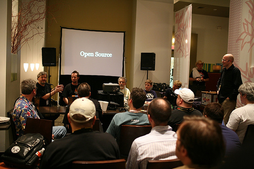
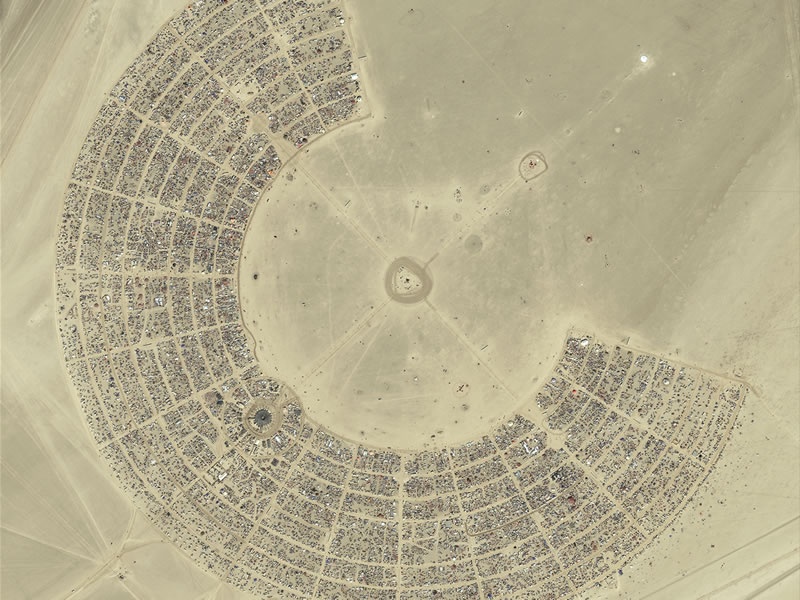
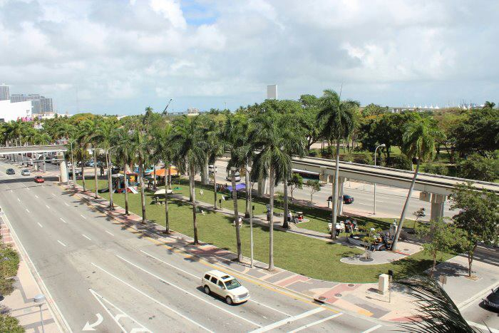
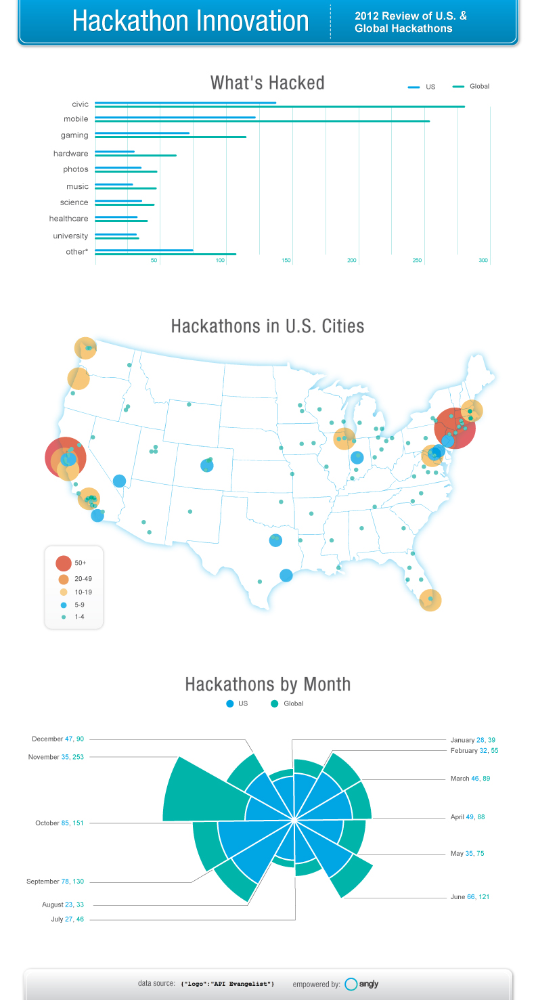

<!--- 
source image: cc-by-nc-nd filip42 https://www.flickr.com/photos/filip42/6059352447/sizes/l/in/photostream/
--->

---

# Utopies en réseau

## *bâtir le monde de demain,* 
## *un événement à la fois*

<!--- 
source image: cc-by-nc-nd filip42 https://www.flickr.com/photos/filip42/6059352447/sizes/l/in/photostream/
--->

---

**Cette présentation est mise à disposition sous licence CC-BY-SA (crédit Lilian Ricaud).**

<!---

**Note: cette présentation a été créée en markdown pour être plus facilement modifiable/réutilisable et vous pouvez la lire ou l'éditer sous forme de diaporama en téléchargeant le logiciel Marp. Ouvrez le fichier avec Marp ou un éditeur texte pour voir les notes du présentateur.**

--->

---

# 3 mini-conférences

- coopération ouverte: de la pyramide à la fourmilière
- tiers lieux: terreau / graines du travail en transition.
- les événements co-créatifs: vers un langage du faire ensemble

---

# un postulat

fil conducteur:
nouveau PARADIGME DE COOPÉRATION
    passage d'un modèle pyramidal à un modèle en réseau
    mode de travail en réseau ouvert
    expérimentation
 mais souhaité et encouragé.
    roles tournants et évolutifs
    éphémères
    communs

---

## coopération ouverte: de la pyramide à la fourmilière

--- 

# Comment travaillons nous ensemble ?

---

<!--- 
improvisation d'un jazz band: les musiciens ne jouent pas une partition prédéfinie, mais sont en écoute les un des autres pour collaborer.

intense et faisable seulement pour de tout petits groupes (2-7)

on "joue" ensemble (sans règles du jeu)

source image CC-BY-SA Aude Vanlathem
https://fr.wikipedia.org/wiki/Fichier:Ligue_d%27improvisation_montr%C3%A9alaise_(LIM)_20110529-32.jpg

--->

---

<!--- 

orchestre: les taches sont réparties préalablement, chacun joue sa partition sous la conduite d'un chef d'orchestre

source de l'image: https://upload.wikimedia.org/wikipedia/commons/e/e6/Concert_orchestre_symphonique_Arsenal_Metz.jpg

Marche bien, mais devient difficile au fur et à mesure que la taille du groupe augmente avec une taille optimale au dessous de 25 personnes. Nécessite un chef, un guide au dela de ce point.

on "joue" ensemble mais comme on jouerai dans le cadre d'un jeu (avec des règles du jeu communes à toustes).

--->

---

<!---
# Command and control

Pour de très larges groupes, avoir un leader et une chaine de commandement devient essentiel.

Cela marche bien pour de très larges groupes, mais cela uniformise les individus. 

cela n'est plus vraiment un jeu et les individus ont tendance à être traités comme des machines.

--->

--- 
# Les modèles pyramidaux et coopératifs ont permis de grandes réussites...

<!--- exemples de réussites et de création absurdes: grace à ce modèles nous avons inventés des voitures qui nous permettent d'aller vite et loin et aussi de passer des heures dans les bouchons...

--->

---

# mais ont des inconvénients forts

<!---

levez la main si ça vous rappelle quelque chose/si vous avez vécu une telle situation

--->

---

---

---

---

---

---

---

---

---

---

---

---

# Modèles compétitifs et hiérarchie pyramidale

----

<!---

moi l'individu, je ne suis pas libre de mes choix et je me sens un peu écrasé par cette hiérachie

--->

---

# Modèles coopératifs et hiérarchie de consensus

----

<!---

même si c'est "coopératif", moi l'individu, je ne suis pas libre de mes choix et je me sens un peu écrasé par cette hiérachie

--->

---

# Hiérarchies pyramidales et de consensus sont des modèles de contrôle *a priori* 

---

# une autre option ?

---

<!--- 

Voyons ce qui se passe chez les termites ? Comment s'organisent elles pour fonctionner ensemble ?

Source image: Photo prise par Bmdavll et mise à disposition sous License GFDL

--->

---

<!---

# Un chef des termites ?

--->

---

<!---
# Un conseil des termites ?

When termites construct their nests, they use predominantly indirect communication. No single termite would be in charge of any particular construction project. Individual termites react rather than think, but at a group level, they exhibit a sort of collective cognition. Specific structures or other objects such as pellets of soil or pillars cause termites to start building. The termite adds these objects onto existing structures, and such behaviour encourages building behaviour in other workers. The result is a self-organised process whereby the information that directs termite activity results from changes in the environment rather than from direct contact among individuals. Source:
https://en.wikipedia.org/wiki/Termite#Communication

--->

---

# Stigmergie

> grecs στιγμα (stigma) « marque, signe » et εργον (ergon) « travail, action »

---

# stigmergie

> La stigmergie est une méthode de communication indirecte dans un environnement émergent auto-organisé, où les individus communiquent entre eux en modifiant leur environnement.

Wikipedia

---

# stigmergie

> La stigmergie est une méthode de **communication indirecte** dans un environnement **émergent auto-organisé**, où les individus communiquent entre eux **en modifiant leur environnement**.

Wikipedia

---

# La stigmergie chez les fourmis

<!---Image:
Par Mehmet Karatay — Travail personnel, CC BY-SA 3.0, https://commons.wikimedia.org/w/index.php?curid=2179109
--->

---

<!---

Notes : 1) la première fourmi trouve la source de nourriture (F), via un chemin quelconque (a), puis revient au nid (N) en laissant derrière elle une piste de phéromone (b). 2) les fourmis empruntent indifféremment les 4 chemins possibles, mais le renforcement de la piste rend plus attractif le chemin le plus court. 3) les fourmis empruntent le chemin le plus court, les portions longues des autres chemins voient la piste de phéromones s'évaporer.

Source: https://commons.wikimedia.org/wiki/File:Aco_branches.svg?uselang=fr

Plus d'informations:

Les fourmis utilisent l’environnement comme support de communication : elles échangent indirectement de l’information en déposant des phéromones, le tout décrivant l’état de leur « travail ». L’information échangée a une portée locale, seule une fourmi située à l’endroit où les phéromones ont été déposées y a accès.

https://fr.wikipedia.org/wiki/Algorithme_de_colonies_de_fourmis

--->

---

<!---
La stigmergie produit des structures complexes

La vidéo ci-dessous montre une fourmilière déterrée par des chercheurs après avoir été remplie de béton pour figer sa structure. Le résultat est à couper le souffle.

https://www.youtube.com/watch?v=lFg21x2sj-M

--->
---

<!---
La stigmergie produit des structures complexes

La structure couvre 50 mètres carrés, descend à 8 mètres de profondeur et lors de sa conception a nécessité le déplacement de 40 tonnes de terre.

Les tunnels sont conçus de façon optimales pour assurer une bonne ventilation mais aussi la route la plus courte,  la structure comportant de véritables  « autoroutes » souterraines et des routes plus petites, connectant des chambres principales, des fosses à ordures, et des « jardins à champignons » où la température et l’humidité sont contrôlées et où les fourmis nourrissent de feuilles broyées un  mycélium qu’elles récoltent ensuite.

On dirait que la structure a été conçue par un architecte génial, mais tout a été fait par l’intelligence collective de la colonie qui se comporte comme un super-organisme.

Pourtant toutes les fourmis ne sont pas actives, une récente étude américaine a révélé qu'au sein d'une colonie de fourmis, près de la moitié est en général inactive.
Read more at http://www.atlantico.fr/decryptage/verite-fourmis-60-entre-elles-sont-grosses-paresseuses-qui-ne-font-rien-et-est-pas-tout-jean-luc-mercier-2228365.html#ziOO23gfqhYZG6pp.99: http://www.atlantico.fr/decryptage/verite-fourmis-60-entre-elles-sont-grosses-paresseuses-qui-ne-font-rien-et-est-pas-tout-jean-luc-mercier-2228365.html

--->

# en résumé, la stigmergie c'est ...

 
---

## un système auto-organisé

 
--- 
##  un mécanisme de coordination indirecte

---

## une boucle: action -> trace -> action ...

--- 

## un mode de fonctionement orienté sur l'action et le choix individuel 

---

## un mécanisme qui produit des structures complexes 

*sans avoir besoin de plan, de contrôle ou même de communication directe entre les agents.*

---
<!---
# D'autres exemples...
--->

<!---
essaim d'oiseau: un groupe d'oiseau en vol, l'ensemble se comporte comme un super-organisme
--->

---

<!---
traffic routier: 
--->

---

---

<!--- 
source image: cc-by-nc-nd filip42 https://www.flickr.com/photos/filip42/6059352447/sizes/l/in/photostream/
--->

--- 

<!---
la construction d'une ville au niveau global se fait (faisait) en grande partie via un processus stigmergique.
--->

<!---

# La ville comme système de stockage et d'accès à l'information

Like-minded businesses cluster together because thee are financial incentives to do so - what academics call economy of agglomeration - enabling craftmen to share techniques and services that they wouldn't necessarily be able to enjoy on their own. That clustering becomes a self perpetuating cycle: potential consumers and employees have an easier time finding the goods and  jobs they're looking for, the shared information makes the clustered businesses more competitive than isolated ones p107
cities have a latent purposer to function as information storage and retrieval device. Cities were creating user-friendly interfaces thousand of years before anyone even dreamed of digital computers. Cities transmit useful new ideas to the wider population ensuring powerful new techniques don't disappear. Steven Johnson, Emergence, p108.
--->

---
# La stigmergie pour les organisations humaines

---

<!--- une très grande partie de ce travail a été inspiré par l'article "Stigmergy" écrit par Heather Marsh. Je n'insisterai jamais assez sur l'importance de lire cet article brillant.

https://georgiebc.wordpress.com/2012/12/24/stigmergy-2/

traduction française: http://www.lilianricaud.com/travail-en-reseau/la-stigmergie-un-nouvelle-modele-de-gouvernance-collaborative/

--->

---

<!---

24,808,989 sites web soit plus de 30% des sites web tournent sous Wordpress 

https://w3techs.com/technologies/overview/content_management/all
- https://trends.builtwith.com/cms/WordPress)

95% de serveurs et plus de 50% des smartphones basés sur linux.

Les communautés du libre

Linux, Wikipédia, WordPress, Firefox … longtemps marginaux, les projets rassemblant des volontaires qui travaillent en collaboration à distance sont de plus en plus courants et concurrencent grandes entreprises et institutions pourtant richement dotés en moyens humains et financiers.

C’est le mode de travail des communautés du libre qui a inspiré Mark Ellliot, auteur d’une publication de référence sur la stigmergie comme cadre intellectuel pour la collaboration dans les grand groupes. (Lire: Stigmergic Collaboration: A Theoretical Framework for Mass Collaboration; Phd,2007)

http://mark-elliott.net/blog/?page_id=24%20

--->

---

<!---
Savez vous que Wikipédia est la première encyclopédie en taille et en consultation ?

(source: 

statistiques à propos de wikipédia avril 2019

https://en.wikipedia.org/wiki/Wikipedia

>318,690 active users and >81,416,982 registered users 1,184 administrators (English)

Available in	303 languages
Nombre de pages
English 5,838,385
Cebuano 5,331,861
Swedish 3,748,771
German 2,290,542
French 2,096,912 

--->

---

<!---

# Processus

une idée initiale est donnée librement, et le projet est conduit par l’idée, pas par une personnalité ou un groupe de personnalités. Aucun individu n’a besoin de permission (modèle compétitif) ou de consensus (modèle coopératif) pour proposer une idée ou initier un projet. Il n’y a pas besoin de discuter ou de voter une idée, si une idée est intéressante ou nécessaire, elle va susciter de l’intérêt. L’intérêt viendra de personnes activement impliquées dans le système et qui auront la volonté de fournir les efforts pour porter le projet plus loin. Cela ne viendra pas de votes vides de personnes qui n’ont qu’un tout petit peu d’intérêt ou d’implication dans le projet . Tant que le projet est soutenu ou rejeté sur la base d’efforts contributifs et non pas sur des votes vides, la contribution de personnes engagées dans l’idée aura plus de poids. La stigmergie met aussi les individus en situation de contrôler leur propre travail, ils n’ont pas besoin de la permission du groupe pour leur dire avec quelle méthode travailler ou à quelle partie contribuer.

--->

---

---

---

# Quelques caractéristiques du modèle stigmergique

---

## Ouverture / autorisation *a priori*

--- 

## liberté de créer sans prendre en compte l'acceptation ou le rejet 

--- 

## liberté d'accepter ou de rejeter un travail, une tache

--- 

## liberté de créer une alternative

---

## coordination via les traces laissées

---

## Pause questions

10-15 min

--- 

# Des tiers lieux aux tiers usages

--- 

---

<!--- source: https://www.makehaven.org/blog/makehaven-becomes-first-fab-lab-connecticut

--->

---

<!---

source

https://coworker.imgix.net/photos/france/lille/la-coroutine/4.jpg

--->

---

<!---
Source: cc-by-sa Manu Pintor
--->

---

# les tiers lieux comme innovation sociale

---

# Quel est notre vocabulaire du faire ensemble ?

<!---

travailler, réunionner, brainstormer, manifester, “conférencer”, quelles autres formes de rencontres utilisez-vous ?

--->

---
# Évènements traditionnels

réunions
conférences
rencontres
manifestations

<!---

Traditionnellement plusieurs types de rencontres professionnelles

--->

---

<!---

Reunion: tout le monde connaît ces réunions interminables où on a peu de temps de parole, où la discussion est très figée...

 Source image: http://www.cafefootball.eu/2011/03/16/blog/ST.-JOHNSTONE-F.C.-HOST-SDSA-MEETING.aspx

--->

---

<!---

Conférence : même s'il y a plusieurs intervenants et même si on laisse le public poser des questions, le format, l'architecture de l'événement (intervenant sur un podium avec micros et face à une foule) ne sont pas adaptés à un grande interactivité.

 Source image: https://designcritique.wordpress.com/page/28/
 
 --->

---

<!---

Manifestation (le plus souvent à de tels évènements les gens sont unis plutôt CONTRE quelque chose que POUR quelque chose) même si quelques individualités sont visibles grâce aux différentes banderoles, la plupart sont noyées dans la foule. On est dans la protestation, pas dans la création.

Source image: http://www.lejdd.fr/International/Europe/Images/decembre-2011/manifestation-russie-443732

--->
---

# Nouveaux évènements co-créatifs

<!---

Depuis plusieurs années on voit de nouveaux formats d'évènements apparaitre. Ceux-ci présentent une grande diversité en apparence, mais on retrouve des caractéristiques communes sous-jacentes. En voici quelque exemples :

--->

---

<!---
Barcamp, une “non-conférence” auto-organisée par les participants qui proposent les sessions par regroupement d'affinités

. Source image: http://www.youngentrepreneur.com/blog/startup-news/this-one-time-%E2%80%93-at-barcamp%E2%80%A6/

--->

---

<!---

Dans un barcamp, chacun est invité à être acteur (" pas de spectateur, tous participants !") et à contribuer à co-produire la “non-conférence”

. Source image: http://blog.webreakstuff.com/2007/07/barcamp-portugal-2007/

--->

---

<!---
L'open Space ou forum ouvert en français, autre mode de rencontre participatif, ancien mais qui a montré sa capacité a accueillir plus de 2000 participants. 

Source image: http://www.youngentrepreneur.com/blog/startup-news/this-one-time-%E2%80%93-at-barcamp%E2%80%A6/
--->

---

<!---

"ignite" (20 diapos, 15 secondes/diapos) et Pecha kucha (20 images, 20 secondes) sont des formats de présentation ultra-rapides, destinés a faire découvrir à un groupe un grand nombre d'idées en peu de temps et à "allumer/enflammer" les idées et la créativité des participants ("ignite" = allumer). Ce format a inspiré le format “ma thèse en 180 secondes ou des doctorants présentent le sujet de leur thèse au grand public en 3 min et une seule diapo.

 Source image: how to become a culture hacker, Seb Paquet https://www.youtube.com/watch?v=ojQT6U-gRAM
 
 --->
 
 ---
 
 
 
 <!---
 
 Hackathon : un "marathon" de hacking où les participants travaillent intensement sur du code dans le but de produire quelque chose à la fin.

 Source image: http://newyork.thecityatlas.org/lifestyle/solutionism-nowhere/attachment/hackathon-2/
 
 --->
 
 ----

 
 <!---
 Install/Coding party. Similaire au "hackathon" dans l'idée de se rassembler pour programmer, mais avec une connotation plus de plaisir (party=fête) et moins de travail intense (marathon). Notez ici l'importance du langage. Le message envoyé lorsqu'on invite quelqu'un a une fête ou a un marathon n'est pas le même. Le simple fait de choisir un nom commence déja à créer une architecture invisible qui va influencer les participants et la rencontre.

 party Source image: http://www.cinemas-utopia.org/U-blog/toulouse/index.php?post/2008/04/03/La-liberte-guidant-le-peuple
 
 --->
 
 ---
 
 
 
 <!---
 
 Accélérateurs de projets: ce format de rencontre/réflexion collective dérivé de méthodes d’éducation populaire vise à aider un porteur de projet à avancer grâce à l'intelligence du groupe. Source image : Moustic 2011
 
Recette: http://www.multibao.org/#cpcoop/animer_ateliers/blob/master/soutenir_porteurs_projets/accelerateur_de_projets.md
 
 --->
 ---
  
 <!---
 
 Batucada participative : un format intéressant expérimenté lors des rencontres moustic 2011 a la fois expérience de coopération vécue (les participants doivent être à l'écoute d'eux-mêmes, de leur groupe et de l'ensemble des particicipants) et aussi brise-glace qui aide a créer du lien et de la convivialité entre une centaine de participants qui pour la plupart ne se connaissaient pas avant.

 Source image: Moustic 2011
 

 --->
 
 
 
 ---

<!--- 

No pants day : un happening artistique où des milliers de participants se rassemblent et se dispersent dans le métro new yorkais pour surprendre et faire sourire, sortir les gens de la routine. Lancé par le collectif Improv Everywhere (aussi inventeur des "Freeze parties"), ce format type flashmob a été copié dans plusieurs villes.

--->

 ---

<!---

Burning man: un festival où des milliers de participants (plus de 50 000 les dernières années) se rassemblent chaque année dans le désert du Nevada pendant une semaine pour une expérience artistique et humaine hors norme. 

Source image: http://elblogdegnomo.blogspot.fr/2010_09_01_archive.html

--->

 ---

<!---

Burning man : un festival où des milliers de participants (plus de 50 000 les dernières années)se rassemblent chaque année dans le désert du Nevada pendant une semaine pour une expérience artistique et humaine hors norme. 

Source image: http://blog.twoonix.com/2011/12/beim-nationalen-it-tag-darf-twoonix-nicht-fehlen/

--->

---

# Des evenements pour prototyper une nouvelle ville

 

 ---

<!---

Si les voitures qui payent peuvent occuper l’espace public, pourquoi les citoyens ne pourraient pas eux aussi occuper l’espace public ? Park(ing) day est une journée de mobilisation festive pour s’approprier l’espace public et faire réfléchir à nos modes de vie, la place des citoyens, des voitures, en créant des parcs temporaires sur des places de parking (et en payant le parcmètre !)

 Source image: ?
 
 --->
 
 ---
 
 
 
  ---
 
 
 
 
 --- 
 
 
 
 <!--- 

Ici le park(ing) day qui a connu un grand succès et synchronise sur une journée des participants de très nombreux endroits autour d’une idée commune. (presque 1000 parcs temporaires en 2011!)

--->
 --->
 
 ---
 
  
  
---
  

 
 ---

<!---

Museomix un évènement ou des professionnel⋅le⋅s et des amateurs se rassemblent en équipe plusieurs jours pour créer des prototypes d'exposition interactifs et innovants. Apparu récemment, ce format Inspiré du hackathon et de burning man a déjà commencé à être dupliqué dans plusieurs villes françaises.

 Source images: Museomix.com
 
 --->

 ---

<!---

Une gratiferia est une sorte de brocante, mais entièrement basée sur le don. Contrairement au troc, il n’y a pas de notion d’échange et chacun est libre de prendre ce qu’il veut (tout en restant raisonnable)
 
Image source: http://laorquesta.mx/slp-organiza-su-primera-gratiferia/

--->

 ---

<!---

Permablitz : un evenement où un groupe d'étudiants conduits par un enseignant en permaculture se regroupe pour transformer un terrain en un jardin de manière très rapide ("blitz" = éclair). 

Source image: http://www.permaculturedesign.fr/un-permablitz-en-haute-vienne/

--->

 ---

<!---

Disco soupe est un événement qui consiste a se rassembler pour récupérér des denrées destinées a être jetées et a cuisiner des plats a partager, le tout en musique d'où la "disco"-soupe. Notez comme le nom "fun" incite à la curiosité et à la découverte.

 Source image: http://blogs.lexpress.fr/suv/2012/09/18/disco-soupe-le-repas-collaboratif-qui-fait-du-bien/

--->

 ---

<!---

C'est un mélange de repas de quartier, de pitch de startups et de micro-financement participatif, le tout en mode auto-organisé.

Le principe : un repas qui sert à récolter des fonds. Les participants payent 5$ pour "une soupe, une salade et un vote". Avant le repas ils assistent à 4 pitch de 4 min de projets sociaux innovants pour améliorer la ville de Detroit. Les participants au repas votent pour un projet, et le projet gagnant reçoit les fond récoltés pour faire avancer son projet, le repas servant aussi à réseauter, créer du lien et des collaborations entre les habitants.

Comme souvent une recette pour partager le mode d'emploi:
http://detroitsoup.com/startyourown/

et un site global pour relier les communautés/événements:
http://sundaysoup.org/

Source image: 

--->
---

---

<!---
source: Source image: http://www.lemag-numerique-rennais.com/2012/10/carto-party-handimap-un-rendez-vous-pour-ameliorer-les-donnees-1784

--->
---

---

---

---

---

Quelles sont les caractéristiques récurrentes ?

- PARTICIPATIF : plus participatifs et dynamiques que les rencontres professionnelles traditionnelles
- OUVERTURE A PRIORI : basés sur des valeurs d'ouverture et de partage
- CO-ORGANISATION : il y a un transition de *organisés pour* vers *co-organisés avec* 
- basés sur le volontariat, l'intérêt, la passion individuelle
- DIVERSITE : n'essayent pas de gommer les différences entres les individus et s'enrichissent de la diversité des participants
- FUN : peu formels et les "fun" (l'amusement, le jeu) fait partie intégrante de l'évènement
- COPIABLE : certains formats à succès se dupliquent spontanément et donnent naissance à des communautés globales. La recette est souvent mise à disposition pour favoriser cela

<!---

Ces formes de rencontres ont une grande diversité mais on retrouve des caractéristiques communes. 

--->

---

patterns événement traditionnels

DESCENDANT : une personne ou un groupe organise et mène la rencontre de manière descendante.

OBLIGATION : il est obligatoire d'assister à la rencontre ou tout du moins mal vu de ne pas y participer

CONTRÔLE A PRIORI : par défaut, ce qui n'est pas implicitement autorisé est interdit ou soumis à un controle.

HOMOGÉNÉITÉ : souvent il est implicitement attendu que chacun soit comme les autres que ce soit au niveau de l'apparence ou 

FORMEL: il est attendu des participants un certain formalisme, une attitude "professionnelle" ou le laisser-aller et les émotions personnelles ne sont pas souhaitables.

INCOPIABLE : mis à part les réunions ou les conférences ou séminaires qui sont tellement standard qu'il n'y a pas de protection, les autres sont incopiables car protégés par un copyright ou l'absence d'indication pour les reproduire.

 ---

<!---

Les formats à succès donnent naissance a des communautés de pratiques globales centrées autour de l'évènement et où des groupes organisent localement leur propres évènements de manière synchrone ou asynchrone. Ici TED, dont le format lui même est peu participatif, mais dont la duplication et l’organisation par des groupes locaux permet une grande diversité d'évènements et de vidéos produites.

--->

---

--- 

Nuit debout, Occupy, Indignés, Alternatiba, 
des micro-utopies en réseau

--- 

## pause

 ---

# Augmenter notre langage du faire ensemble

comment construire ensemble des lieux, des objets, une gouvernance ?

---

---

---

---

---

---

---

---
