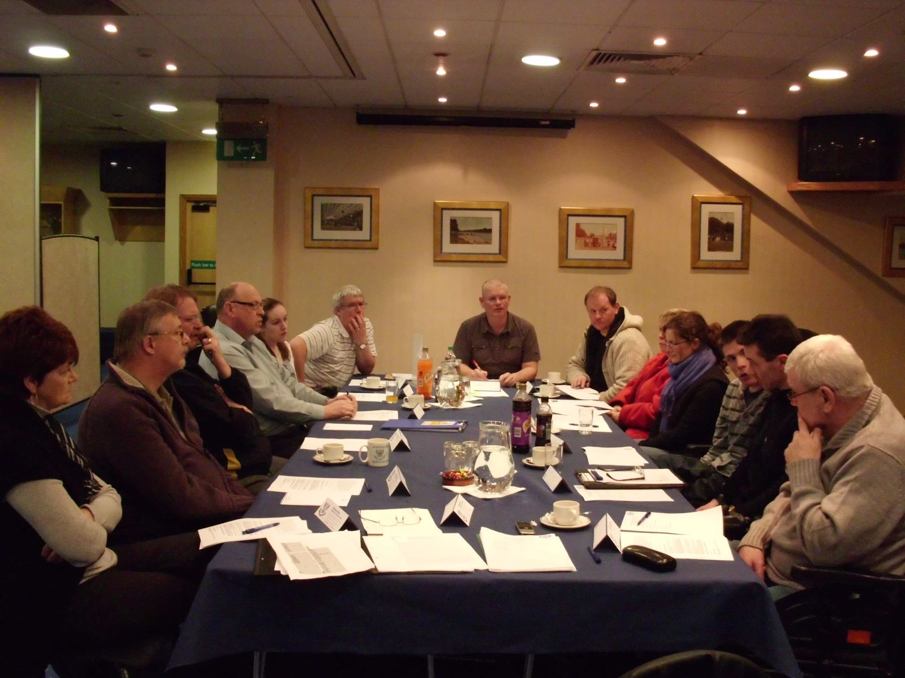
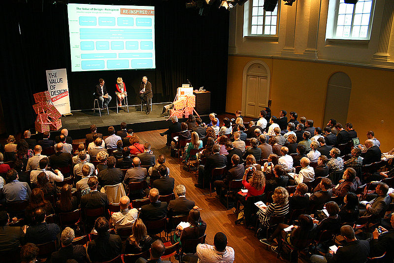
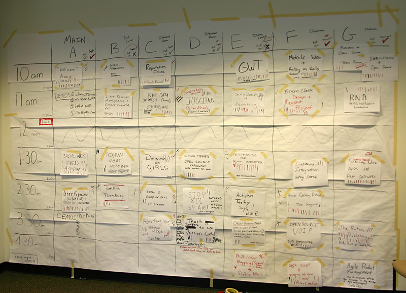
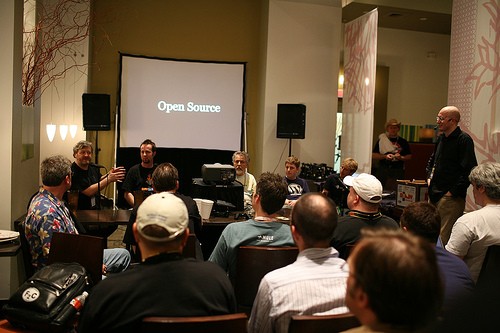
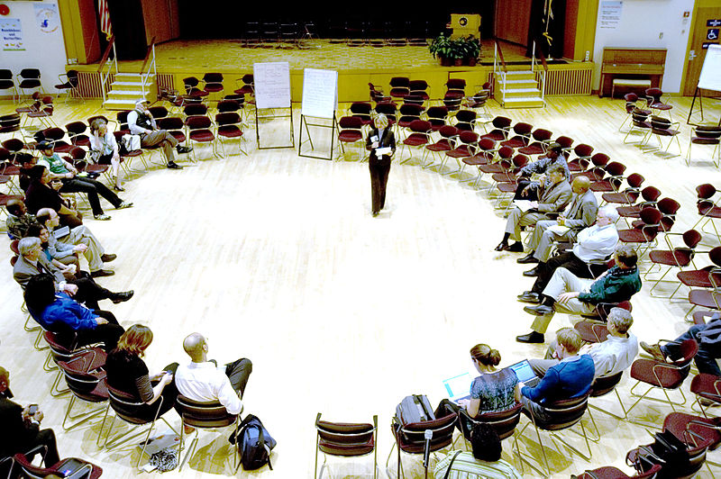
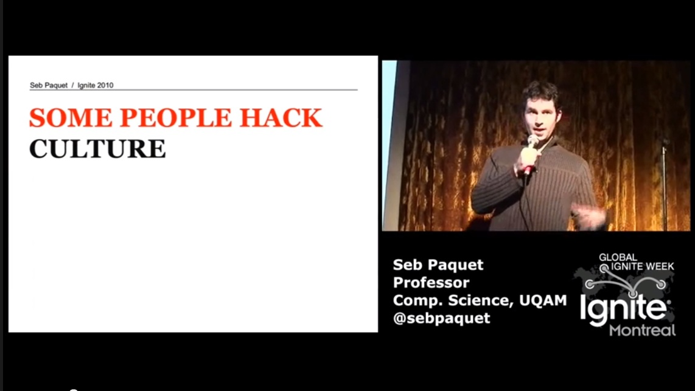
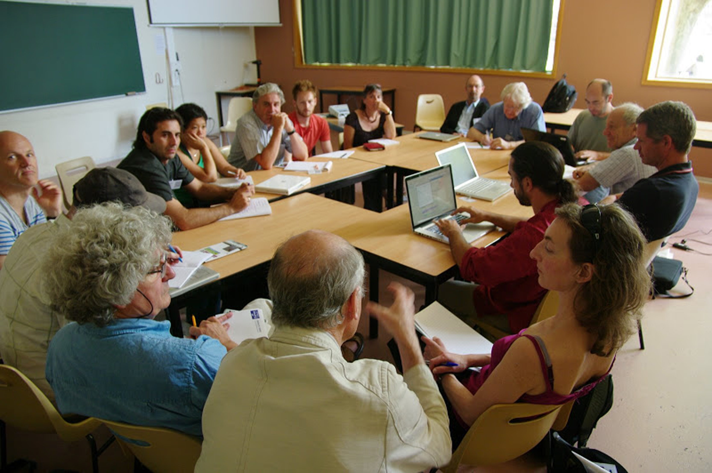

# Les nouveaux évènements co-créatifs
## Du “DIY” (Do it Yourself) au “DIT” (Do it Together)

---

<!---

présentation en cours de conversion en format libre:

l'originale: https://docs.google.com/presentation/d/1-cXRp1kNKPGFG5YsFH5os3KEkfVRLXA-D5Xv-ZfLSCA/edit#slide=id.gd163ff77_011

# Quel est notre vocabulaire du faire ensemble ?

<!---

travailler, réunionner, brainstormer, manifester, “conférencer”, quelles autres formes de rencontres utiliser vous ?

--->

---
# Évènements traditionnels

réunions
conférences
rencontres
manifestations

<!---

Traditionnellement plusieurs types de rencontres professionnelles

--->

---

<!---

Reunion: tout le monde connaît ces réunions interminables où on a peu de temps de paroles, où la discussion est très figée...

 Source image: http://www.cafefootball.eu/2011/03/16/blog/ST.-JOHNSTONE-F.C.-HOST-SDSA-MEETING.aspx

--->

---

<!---

Conférence: même s'il y a plusieurs intervenants et même si on laisse le public poser des questions le format, l'architecture de l'evenement (intervenant sur un podium avec micros et face à une foule) ne sont pas adapté à un grande interactivité.

 Source image: https://designcritique.wordpress.com/page/28/
 
 --->

---

<!---

Manifestation (le plus souvent de tels évènements les gens sont unis CONTRE quelque chose que POUR quelque chose) même si quelques individualités sont visibles grâce aux différentes banderolles, la plupart sont noyées dans la foule. On est dans la protestation pas dans la création.

Source image: http://www.lejdd.fr/International/Europe/Images/decembre-2011/manifestation-russie-443732

--->
---

# Nouveaux évènements co-créatifs

<!---

Depuis plusieurs années on voir de nouveaux formats d'évènements apparaitrent. Ceux ci présentent une grande diversité en apparence, mais ont retrouve des caractéristiques communes sous jacentes. en voici quelque exemples:

--->

---

<!---
Barcamp, une “non-conférence” auto-organisée par les participants qui organisent les sessions par regroupement d'affinités

. Source image: http://www.youngentrepreneur.com/blog/startup-news/this-one-time-%E2%80%93-at-barcamp%E2%80%A6/

--->

---

<!---

Dans un barcamp, chacun est invité a être acteur (" pas de spectateur, tous participants !") et à contribuer à co-produire la “non-conférence”

. Source image: http://blog.webreakstuff.com/2007/07/barcamp-portugal-2007/

--->

---

<!---
Oepn Space, autre mode de rencontre participatif, ancien mais a montré sa capacité a accueillir plus de 2000 participants. 

Source image: http://www.youngentrepreneur.com/blog/startup-news/this-one-time-%E2%80%93-at-barcamp%E2%80%A6/
--->

---

<!---

"ignite" (20 diapos, 15 secondes/diapos) et Pecha kucha (20 images, 20 secondes) sont des formats de présentation ultra rapide, destinés a faire découvrir à un groupe un grand nombre d'idée en peu de temps et à "allumer/enflammer" les idées et la créativité des participants ("ignite" = allumer). Ce format a inspiré le format “ma thèse en 180 secondes ou des docorants présentent le sujet de leur thèse au grand public en 3 min et une seule diapo.

 Source image: how to become a culture hacker, Seb Paquet https://www.youtube.com/watch?v=ojQT6U-gRAM
 
 --->
 
 ---
 
 
 
 <!---
 
 Hackathon: un "marathon" de hacking où les participants travaillent intensement sur du code dans le but de produire quelque chose à la fin.

 Source image: http://newyork.thecityatlas.org/lifestyle/solutionism-nowhere/attachment/hackathon-2/
 
 --->
 
 ----

 
 <!---
 Install/Coding party. Similaire au "hackathon" dans l'idée de se rassembler pour programmer, mais avec une connotation plus de plaisir (party=fête) et moins de travail intense (marathon). Notez ici l'importance du langage. Le message envoyé lorsqu'on invite quelqu'un a une fête ou a un marathon n'est pas le même. Le simple fait de choisir un nom commence déja à créer une architecture invisible qui va influencer les participants et la rencontre.

 party Source image: http://www.cinemas-utopia.org/U-blog/toulouse/index.php?post/2008/04/03/La-liberte-guidant-le-peuple
 
 --->
 
 ---
 
 
 
 <!---
 
 Accélérateurs de projets: ce format de rencontre/reflexion collective dérivé de méthode d’éducation populaire vise a aider un porteur de projet à avancer grace à l'intelligence du groupe. Source image: Moustic 2011
 
Recette: http://www.multibao.org/#cpcoop/animer_ateliers/blob/master/soutenir_porteurs_projets/accelerateur_de_projets.md
 
 --->
 ---
 
 <!---
 
 Batucada participative: un format intéressant expérimenté lors des rencontres moustic 2011 a la fois expérience de coopération vécue (les participants doivent être à l'écoute d'eux mêmes, de leur groupe et de l'ensemble des particiicipants) et aussi brise glace qui aide a créer du lien et de la convivialité entre une centaine de participants qui pour la plupart ne se connaissait pas avant.

 Source image: Moustic 2011
 --->
 
 
 ---
 # Comment aller plus loin ? Identifier les ingrédients clés qui marchent ?
 
 
 - patterns comme outil de lecture des systèmes complexe
 - utilisé pour identifier les ingrédients présents dans plusieurs formats
 
 
 
 ---
 # Trame
 donner envie, apprendre les bases, apprentissage avancé, au dela de la maitrise (shu ha ri)
 