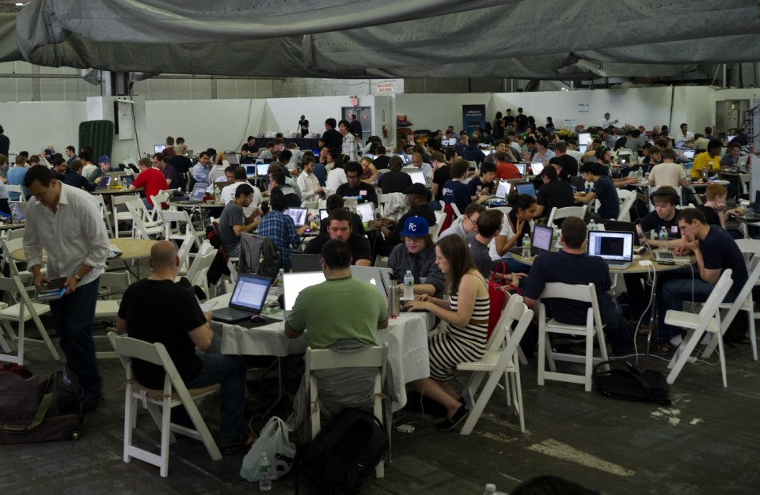

# Les nouveaux évènements co-créatifs
## Du “DIY” (Do it Yourself) au “DIT” (Do it Together)

---

<!---

présentation en cours de conversion en format libre:

l'originale: https://docs.google.com/presentation/d/1-cXRp1kNKPGFG5YsFH5os3KEkfVRLXA-D5Xv-ZfLSCA/edit#slide=id.gd163ff77_011

# Quel est notre vocabulaire du faire ensemble ?

<!---

travailler, réunionner, brainstormer, manifester, “conférencer”, quelles autres formes de rencontres utiliser vous ?

--->

---
# Évènements traditionnels

réunions
conférences
rencontres
manifestations

<!---

Traditionnellement plusieurs types de rencontres professionnelles

--->

---

<!---

Reunion: tout le monde connaît ces réunions interminables où on a peu de temps de paroles, où la discussion est très figée...

 Source image: http://www.cafefootball.eu/2011/03/16/blog/ST.-JOHNSTONE-F.C.-HOST-SDSA-MEETING.aspx

--->

---

<!---

Conférence: même s'il y a plusieurs intervenants et même si on laisse le public poser des questions le format, l'architecture de l'evenement (intervenant sur un podium avec micros et face à une foule) ne sont pas adapté à un grande interactivité.

 Source image: https://designcritique.wordpress.com/page/28/
 
 --->

---

<!---

Manifestation (le plus souvent de tels évènements les gens sont unis CONTRE quelque chose que POUR quelque chose) même si quelques individualités sont visibles grâce aux différentes banderolles, la plupart sont noyées dans la foule. On est dans la protestation pas dans la création.

Source image: http://www.lejdd.fr/International/Europe/Images/decembre-2011/manifestation-russie-443732

--->
---

# Nouveaux évènements co-créatifs

<!---

Depuis plusieurs années on voir de nouveaux formats d'évènements apparaitrent. Ceux ci présentent une grande diversité en apparence, mais ont retrouve des caractéristiques communes sous jacentes. en voici quelque exemples:

--->

---

<!---
Barcamp, une “non-conférence” auto-organisée par les participants qui organisent les sessions par regroupement d'affinités

. Source image: http://www.youngentrepreneur.com/blog/startup-news/this-one-time-%E2%80%93-at-barcamp%E2%80%A6/

--->

---

<!---

Dans un barcamp, chacun est invité a être acteur (" pas de spectateur, tous participants !") et à contribuer à co-produire la “non-conférence”

. Source image: http://blog.webreakstuff.com/2007/07/barcamp-portugal-2007/

--->

---

<!---
L'open Space ou forum ouvert en français autre mode de rencontre participatif, ancien mais a montré sa capacité a accueillir plus de 2000 participants. 

Source image: http://www.youngentrepreneur.com/blog/startup-news/this-one-time-%E2%80%93-at-barcamp%E2%80%A6/
--->

---

<!---

"ignite" (20 diapos, 15 secondes/diapos) et Pecha kucha (20 images, 20 secondes) sont des formats de présentation ultra rapide, destinés a faire découvrir à un groupe un grand nombre d'idée en peu de temps et à "allumer/enflammer" les idées et la créativité des participants ("ignite" = allumer). Ce format a inspiré le format “ma thèse en 180 secondes ou des docorants présentent le sujet de leur thèse au grand public en 3 min et une seule diapo.

 Source image: how to become a culture hacker, Seb Paquet https://www.youtube.com/watch?v=ojQT6U-gRAM
 
 --->
 
 ---
 
 
 
 <!---
 
 Hackathon: un "marathon" de hacking où les participants travaillent intensement sur du code dans le but de produire quelque chose à la fin.

 Source image: http://newyork.thecityatlas.org/lifestyle/solutionism-nowhere/attachment/hackathon-2/
 
 --->
 
 ----

 
 <!---
 Install/Coding party. Similaire au "hackathon" dans l'idée de se rassembler pour programmer, mais avec une connotation plus de plaisir (party=fête) et moins de travail intense (marathon). Notez ici l'importance du langage. Le message envoyé lorsqu'on invite quelqu'un a une fête ou a un marathon n'est pas le même. Le simple fait de choisir un nom commence déja à créer une architecture invisible qui va influencer les participants et la rencontre.

 party Source image: http://www.cinemas-utopia.org/U-blog/toulouse/index.php?post/2008/04/03/La-liberte-guidant-le-peuple
 
 --->
 
 ---
 
 
 
 <!---
 
 Accélérateurs de projets: ce format de rencontre/reflexion collective dérivé de méthode d’éducation populaire vise a aider un porteur de projet à avancer grace à l'intelligence du groupe. Source image: Moustic 2011
 
Recette: http://www.multibao.org/#cpcoop/animer_ateliers/blob/master/soutenir_porteurs_projets/accelerateur_de_projets.md
 
 --->
 ---
  
 <!---
 
 Batucada participative: un format intéressant expérimenté lors des rencontres moustic 2011 a la fois expérience de coopération vécue (les participants doivent être à l'écoute d'eux mêmes, de leur groupe et de l'ensemble des particiicipants) et aussi brise glace qui aide a créer du lien et de la convivialité entre une centaine de participants qui pour la plupart ne se connaissait pas avant.

 Source image: Moustic 2011
 

 --->
 
 
 
 ---

<!--- 

No pants day: un happening artistique où des milliers de participants se rassemblent et se dispersent dans le métro new yorkais pour surprendre et faire sourire, sortir les gens de la routine. Lancé par le collectif Improv Everywhere (aussi inventeur des "Freeze parties"), ce format type flashmob a été copié dans plusieurs villes.

--->

 ---

<!---

Burning man: un festival où des milliers de participants (plus de 50 000 les dernières années)se rassemblent chaque année dans le desert du nevada pendant une semaine pour une expérience artistique et humaine hors norme. 

Source image: http://elblogdegnomo.blogspot.fr/2010_09_01_archive.html

--->

 ---

<!---

Burning man: un festival où des milliers de participants (plus de 50 000 les dernières années)se rassemblent chaque année dans le desert du nevada pendant une semaine pour une expérience artistique et humaine hors norme. 

Source image: http://blog.twoonix.com/2011/12/beim-nationalen-it-tag-darf-twoonix-nicht-fehlen/

--->

 ---

<!---

Museomix un évènement ou des professionnelles et des amateurs se rassemblent en équipe plusieurs jours pour créer des prototypes d'exposition interactifs et innovants. Apparu récemment, ce format Inspiré du hackathon et de burning man a déja commencé a être dupliqué dans plusieurs villes française.

 Source images: Museomix.com
 
 --->

 ---

<!---

Une gratiferia est une sorte de brocante, mais entièrement basé sur le don. Contrairement au troc, il n’y a pas de notion d’échange et chacun est libre de prendre ce qu’il veut (tout en restant raisonable)
 
Image source: http://laorquesta.mx/slp-organiza-su-primera-gratiferia/

--->

 ---

<!---

Si les voitures qui payent peuvent occuper l’espace public, pourquoi les citoyens ne pourraient pas eux aussi occuper l’espace public ? Park(ing) day est une journée de mobilisation festive pour s’approprier l’espace public et faire réfléchir à nos modes de vie, la place des citoyens, des voitures, en créant des parcs temporaires sur des places de parking (et en payant le parcmètre !)

 Source image: ?
 
 --->

 ---

<!---

Permablitz: un evenement où un groupe d'étudiants conduits par un enseignant en permaculture se regroupe pour transformer un terrain en un jardin de manière très rapide ("blitz" = éclair). 

Source image: http://www.permaculturedesign.fr/un-permablitz-en-haute-vienne/

--->

 ---

<!---

Disco soupe est un événement qui consiste a se rassembler pour récupérér des denrées destinées a être jetées et a cuisiner des plats a partager, le tout en musique d'où la "disco"-soupe. Notez comme le nom "fun" incite à la curiosité et à la découverte.

 Source image: http://blogs.lexpress.fr/suv/2012/09/18/disco-soupe-le-repas-collaboratif-qui-fait-du-bien/

--->

 ---

<!---

C'est un mélange de repas de quartier, de pitch de startups et de micro-financement participatif, le tout en mode auto-organisé.

Le principe: un repas qui sert à récolter des fonds. Les participants payent 5$ pour "une soupe, une salade et une vote". Avant le repas ils assistent à 4 pitch de 4 min de projets sociaux innovants pour améliorer la ville de Detroit. Les participants au repas votent pour un projet, et le projet gagnant reçoit les fond récoltés pour faire avancer son projet, le repas servant aussi à réseauter, créer du lien et des collaborations entre les habitants.

Comme souvent une recette pour partager le mode d'emploi:
http://detroitsoup.com/startyourown/

et un site global pour relier les communautés/événements:
http://sundaysoup.org/

Source image: 

--->

---

Quelles sont les caractéristiques récurrentes ?

- PARTICIPATIF: Plus participatifs et dynamiques que les rencontres professionnelles traditionnelles
- OUVERTURE A PRIORI: basés sur des valeurs d'ouverture et de partage
- CO-ORGANISATION:: il y a un transition de *organisés pour* vers *co-organisés avec* 
- basés sur le volontariat, l'intéret, la passion individuelle
- DIVERSITE: n'essayent pas de gommer les différences entres les individus et s'enrichissent de la diversité des participants
- FUN: peu formels et les "fun" (l'amusement, le jeu) fait partie intégrante de l'évènement
- COPIABLE: certains formats à succès se dupliquent spontanément et donnent naissance à des communautés globales. La recette est souvent mis à disposition pour favoriser cela

<!---

Ces formes de rencontres ont une grande diversité mais on retrouve des caractéristiques communes. 

--->

---

patterns evenement traditionnels

DESCENDANT: une personn ou un groupe organise et mène la rencontre de manière descendante.

OBLIGATION: il est obligatoire d'assister à la rencontre ou tout du moins mal vu de ne pas y participer

CONTROLE A PRIORI: par défaut, ce qui n'est pas implicitement autorisé est interdit ou soumis à un controle.

HOMOGENEITE: souvent il est iplicitement attendu que chacun soit comme les autres que ce soit au niveau de l'apparence ou 

FORMEL: il es attendu des participants un certain formalisme, una attitude "professionnelle" ou le laisser-aller et les émotions personnelles ne sont pas souhaitables.

INCOPIABLE: mis à part les réunions ou les conférences ou séminaire qui sont tellement standard qu'il n'y a pas de protection, les autres sont incopiables car protégés par un copyright ou l'absence d'indication pour les reproduire.

 ---

<!---

Les formats à succès donnent naissance a des communautés de pratiques globales centrées autour de l'évènement et où des groupes organisent localement leur propres évènements de manière synchrone ou asynchrone. Ici TED, dont le format lui même est peu participatifs, mais dont la duplication et l’organisation par des groupes locaux permet une grande diversité d'évènements et de vidéos produites.

--->

 ---

<!---

Ici le park(ing) day qui a connu un grand succès et synchronise sur une journée des participants de très nombreux endroits autour d’une idée commune. (presque 1000 parcs temporaire en 2011!)

--->

 ---
 
# Enrichir notre vocabulaire du faire ensemble

---

  
 
 # C'est quoi la règle du jeu ?
 
<!--- 
importance d'expliciter la règle du jeu (exemple ds réunions règle du jeu implicite: ça dure plutot autour d'une heure ou plus, ceux qui sont le plus extravertis monopolisent la parole, il n'y a généralement pas de role prédéfini à part parfois un animateur, on est généralement assis et autour d'une table, l'objectif est généralement aussi flou que les ingrédients. Tous ces éléments qui semblent naturels pourraient être requestionné et il n'y a aucun obligation de les avoir, pourtant la plupart des réunions fonctionnent de cette manière comme si c'était une règle obligatoire).

--->
 
---

  
 
 #  Football ou soccer ?
 
 
 <!---
 Un evenement peut être vu comme une sorte de jeu. Les règles commune régissent l’interaction et le fonctionnement du faire ensemble. C’est parce que chaque participant accepte qu’au football on ne peut pas toucher le ballon avec les mains (sauf exceptions très précises) que l’on peut jouer ensemble. 

Ce cadre permet ensuite de s’amuser ensemble.

Noter que formaliser avec des règles et un nom précis permet aussi d’avoir un vocabulaire commun. Ainsi quand je parle dis “vous voulez jouer au foot?” Tout le monde sait que je propose un jeu ou on ne peut pas toucher le ballon avec les mains. 

Image: Street football à Caracas CC-BY Diego Cupolo https://en.wikipedia.org/wiki/Street_football#mediaviewer/File:Caracas_2010_Series.jpg
--->
 
 ---
 
 
 
 <!--- si je vous parle d'une réunion, vous me comprenez a peu près, si je vous parle d'une réunion ou le sparticipants sont assis en cercle ou seuls certains peuvent parler à certains moments prédéfinis, je devrai vous parler du format qui, ce qui prends un certain temps.
 
 si je ne dispose pas d'un mot pour cet ensemble de règle, ce jeu, alors je devrai chaque fois trouver un moyen de désigner ce format en particulier.
 
 Nommer avec un vocabulaire commun nous permettra alors de nous aligner plus facilement avec moins de bla bla.
 
 
 de tels evenement sont nombreux, ils n'attendent qu'un vocabulaire commun pour se propsager et bientot il y aura des accents, et des argots puis des langues, mais au dela des chapelles existantes (agilité, educ pop, ...)
 --->
 
 ---
 
 exemples evenements avec recette
 
 disco soupe
 alternatiba
 incroyable comestibles
 permablitz
 
 ---
 
 Le contexte influence les interactions de groupe
 
 night club vs bureau
 
 ---
  
 
 
<!--- En boite de nuit, nous nous attendons à rencontrer des nouvelles personnes, nous amuser, flirter, mais s’il est possible de faire un brainstorm ou un travail sérieux, ce n’est probablement pas le meilleur endroit pour cela.

Image source: http://www.stag-bratislava.com/activity-bratislava-guided-night-club-entrance

--->
 
 ---
 
 
 <!---
 De même en réunion au bureau, on peut s’attendre à faire un travail sérieux, un brainstorm, prendre des décisions, mais bien qu’il soit aussi possible de s’amuser ou de flirter, ce n’est probablement pas le meilleur endroit.

Image source: http://business.wikinut.com/img/yj_5c-dzbum7t2je/Office

--->
 
 
 ---
 
 # Le rôle des architectures
 
 La même architecture est susceptible déclencher les mêmes résultats collectifs, peu importe les sujets, les défis, les places de marché et les acteurs qui sont en son centre. Une architetcure différente peut augmenter ou réduire la cpacité d'une communauté à faire face à ces sujets donnés, défis, places de marché, acteur. Les architectures influencent non seulement nos capacités, mais elles créent une nouvelle réalité (Noubel, J-F 2007)
 
 # Capital culturel
 - rendre visible
 - rendre partageable

des recettes pour documenter rendre visible et partageable
des recettes libres pour être réutilisables

<!---

Jean-François Noubel a écrit un article remarquable sur l’importance des architectures sur les rapports humains. Les architectures, au sens large, désignent les espaces structurés dans lesquels nous évoluons individuellement et collectivement.
Ces espaces peuvent être facilement accessibles par nos sens (architecture des bâtiments, occupation de l’espace) ou perçues partiellement (langage, argent, convention sociales,…).
Dans le premier cas on parle d’architectures visibles, dans le second cas d’architectures invisibles. Un même groupe se comportera différemment selon l’architecture dans lequel il évolue.
Par exemple l’interaction au sein d’un groupe sera différente si tout le monde est assis en cercle ou bien si un audience est assise face à un speaker sur scène.
Dans la configuration speaker-audience, le speaker (souvent sur scène, parfois avec micro) monopolise la parole, et même si le public peut participer, cette participation est très limitée, tandis que dans une table ronde l’interaction peut être beaucoup plus interactive.

Texte original:

The same architecture is likely to trigger the same collective outcomes no matter what topics, challenges, market places and players are in its center. A different architecture may empower or diminish the capability of a community to deal with these given topics, challenges, market places, players. Architectures not only influence our capabilities, but they create new reality (Noubel, J.F. 2007)

Extrait de: http://www.thetransitioner.org/Architectures_and_HR_JFNoubel_v1.0.pdf

--->

---

# vocabulaire commun pour se fédérer autour d'un objectif commun

--- 
# evenement = Zone Autonome Temporaire

---
# Evnement = bulle ou peut hacker ponctuellement la routine

---

# Reinventer nos façons de faire et vivre ensemble

# Expérimentez, documentez, partagez !

 

 ---

 ---

 ---

 ---

 ---

 ---

 ---

 ---

 
 ---
 # Comment aller plus loin ? Identifier les ingrédients clés qui marchent ?
 
 
 - patterns comme outil de lecture des systèmes complexe
 - utilisé pour identifier les ingrédients présents dans plusieurs formats
 
 
 
 ---
 # Trame
 donner envie, apprendre les bases, apprentissage avancé, au dela de la maitrise (shu ha ri)
 